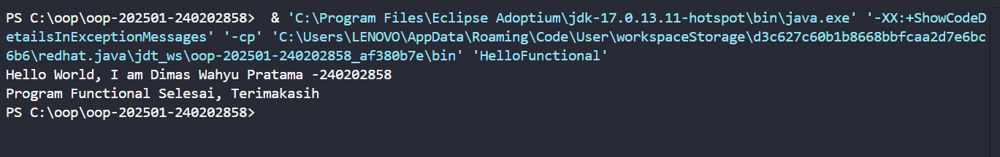
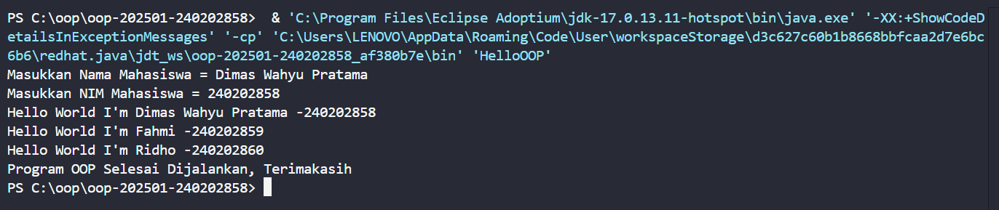
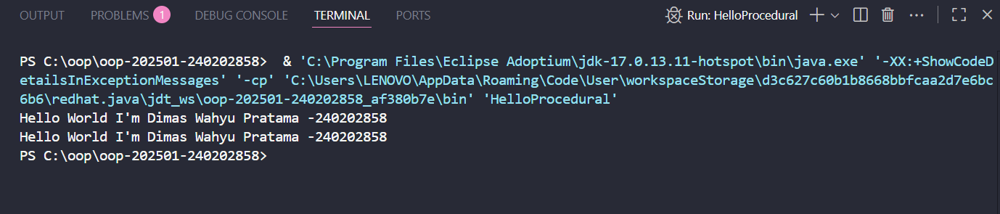

# Laporan Praktikum Minggu 1
Topik: Pengenalan 3 paradigma pemrograman yaitu = Prosedural,OOP, dan Fungsional

## Identitas
- Nama  : Dimas Wahyu Pratama
- NIM   : 240202858
- Kelas : 3IKRA

---

## Tujuan
- Mahasiswa memahami perbedaan paradigma pemrograman: prosedural, OOP, dan fungsional.  
- Mahasiswa dapat mengimplementasikan program sederhana menggunakan ketiga paradigma.  
- Mahasiswa mampu menganalisis kelebihan dan kekurangan dari setiap paradigma.

---

## Dasar Teori
1. **Paradigma Prosedural**: program dibangun dari urutan instruksi step-by-step, dapat menggunakan fungsi untuk modularitas.  
2. **Paradigma OOP**: berorientasi pada objek yang terdiri dari atribut (state) dan method (behavior).  
3. **Paradigma Fungsional**: berfokus pada fungsi murni (*pure function*), immutability, dan deklaratif.  
4. Java mendukung ketiga paradigma ini: prosedural melalui method statis, OOP melalui class dan objek, fungsional melalui lambda expression dan functional interface.

---

## Langkah Praktikum
1. Membuat tiga file program Java:
   - `HelloProcedural.java` untuk implementasi paradigma prosedural.  
   - `HelloOOP.java` dan `Mahasiswa.java` untuk paradigma OOP.  
   - `HelloFunctional.java` untuk paradigma fungsional.  
2. Menuliskan kode sesuai paradigma.  
3. Menjalankan program di terminal/IDE.  
4. Melakukan commit dan upload ke repository Git.

---

## Kode Program

### 1. Prosedural
```java
// HelloProcedural.java
public class HelloProcedural {
    
    // Method 
    public static void sapa(String nama, String nim){
        System.out.println("Hello World I'm "+ nama + " -"+ nim);
    }

    public static void main(String[] args) {
        // Prosedural Tanpa Method
        String nama = "Dimas Wahyu Pratama";
        String nim = "240202858";
        System.out.println("Hello World I'm "+ nama + " -"+ nim);
        
        // Prosedural dengan method
        sapa("Dimas Wahyu Pratama", "240202858");
    }
}
```

### 2. OOP
```java
// HelloOOP.java
import java.util.Scanner;

class Mahasiswa {
    String nama, nim;

    Mahasiswa(String nama, String nim){
        this.nama = nama;
        this.nim = nim;
    }

    public void sapa(){
        System.out.println("Hello World I'm "+ nama + " -"+ nim);
    }
}

public class HelloOOP {
    public static void main(String[] args) {
        Scanner userInput = new Scanner(System.in);

        System.out.print("Masukkan Nama Mahasiswa = ");
        String nama = userInput.nextLine();
        System.out.print("Masukkan NIM Mahasiswa = ");
        String nim = userInput.nextLine();

        Mahasiswa nm1 = new Mahasiswa(nama, nim);
        Mahasiswa nm2 = new Mahasiswa("Fahmi", "240202859");
        Mahasiswa nm3 = new Mahasiswa("Ridho", "240202860");

        nm1.sapa();
        nm2.sapa();
        nm3.sapa();

        System.out.println("Program OOP Selesai Dijalankan, Terimakasih");
    }
}
```

### 3. Prosedural
```java
// HelloFunctional.java
import java.util.function.BiConsumer;

public class HelloFunctional {
    public static void main(String[] args) {
        BiConsumer<String, String> sapa = 
            (nama, nim) -> System.out.println("Hello World, I am " + nama + " -" + nim);

        sapa.accept("Dimas Wahyu Pratama", "240202858");
        System.out.println("Program Functional Selesai, Terimakasih");
    }
}
```
---

## Hasil Eksekusi




---

## Analisis
- Prosedural: kode berjalan secara berurutan. Menggunakan fungsi statis (sapa) bisa mengurangi duplikasi, tetapi tidak terstruktur untuk program besar.
- OOP: setiap mahasiswa direpresentasikan sebagai objek dengan atribut nama dan nim. Method sapa() adalah behavior dari objek tersebut. Program menjadi lebih modular dan mudah dikembangkan.
- Functional: menggunakan lambda expression (BiConsumer) untuk membuat fungsi murni sapa. Kode lebih ringkas dan ekspresif, tetapi di Java sintaks fungsional cenderung lebih verbose dibanding bahasa functional murni.

### Kendala yang Dihadapi
1. Input nama lebih dari satu kata awalnya tidak terbaca dengan baik karena penggunaan `Scanner.next()`.  
   **Solusi:** mengganti dengan `Scanner.nextLine()`.  
2. Kebingungan penggunaan `static` pada method, yang akhirnya dipahami bahwa method `sapa()` sebaiknya non-static karena membutuhkan data dari objek.  
---

## Kesimpulan
- Paradigma prosedural cocok untuk program sederhana karena mudah dan cepat dibuat.  
- Paradigma OOP lebih terstruktur, modular, dan cocok untuk program skala besar.  
- Paradigma fungsional menawarkan cara yang deklaratif dan ringkas, terutama untuk operasi berbasis fungsi, meskipun di Java sintaksnya agak panjang.  
- Mahasiswa dapat memahami perbedaan pendekatan ketiga paradigma dalam implementasi program sederhana.  
---

## Quiz
1. Apakah OOP selalu lebih baik dari prosedural?  
   **Jawaban:** Tidak selalu. OOP lebih baik untuk program besar karena modular dan reusable, tapi untuk program kecil yang sederhana, prosedural lebih cepat dan mudah dibuat.  

2. Kapan functional programming lebih cocok digunakan dibanding OOP atau prosedural?  
   **Jawaban:** Functional cocok dipakai saat mengolah data dalam jumlah besar, pemrosesan paralel/stream, atau aplikasi AI/ML, karena minim side-effect dan lebih aman dalam environment multi-thread.  

3. Bagaimana paradigma (prosedural, OOP, fungsional) memengaruhi maintainability dan scalability aplikasi?  
   **Jawaban:**  
   - Prosedural: maintainability rendah, rawan spaghetti code, sulit diskalakan.  
   - OOP: lebih mudah dimaintain dan diskalakan karena modularitas (class & object).  
   - Functional: sangat maintainable untuk operasi data dan parallel, tetapi lebih sulit untuk I/O kompleks.  

4. Mengapa OOP lebih cocok untuk mengembangkan aplikasi POS dibanding prosedural?  
   **Jawaban:** Karena aplikasi POS melibatkan banyak entitas nyata (Produk, Transaksi, Pelanggan) yang lebih mudah dimodelkan sebagai objek dengan atribut dan perilaku. Hal ini membuat program lebih terstruktur, mudah dikembangkan, dan lebih scalable dibanding prosedural.  

5. Bagaimana paradigma fungsional dapat membantu mengurangi kode berulang (boilerplate code)?  
   **Jawaban:** Dengan memanfaatkan fungsi murni, higher-order function, dan lambda expression, developer bisa menulis logika sekali lalu dipakai ulang tanpa perlu banyak kode tambahan. Hal ini mengurangi boilerplate dan membuat kode lebih ringkas.  
---
