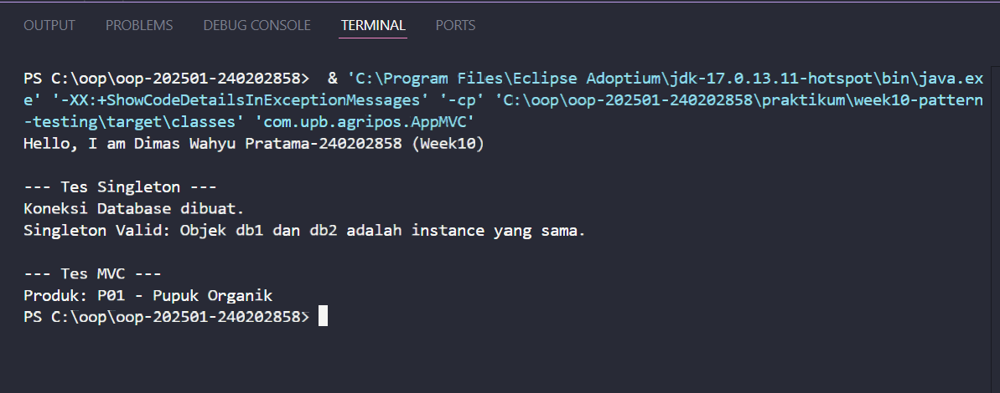
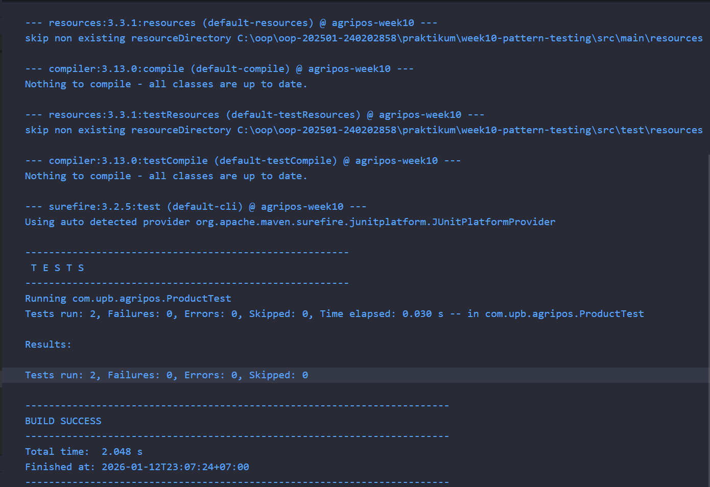

# Laporan Praktikum Minggu 10
Topik: Design Pattern (Singleton, MVC) dan Unit Testing

## Identitas
- **Nama** : Dimas Wahyu Pratama
- **NIM** : 240202858
- **Kelas** : 3IKRA

---

## Tujuan
1. Mahasiswa mampu memahami dan mengimplementasikan **Singleton Pattern** untuk membatasi instansiasi objek.
2. Mahasiswa mampu menerapkan arsitektur **MVC (Model-View-Controller)** untuk memisahkan logika bisnis, data, dan tampilan.
3. Mahasiswa mampu melakukan **Unit Testing** menggunakan framework **JUnit** untuk memastikan kode berjalan sesuai spesifikasi.

---

## Dasar Teori
1. **Design Pattern**: Solusi desain yang telah teruji untuk menyelesaikan masalah umum dalam pengembangan perangkat lunak.
2. **Singleton Pattern**: Pola desain yang menjamin suatu class hanya memiliki satu *instance* dan menyediakan titik akses global. Karakteristik utamanya adalah constructor yang bersifat `private` dan method `static getInstance()`.
3. **MVC (Model-View-Controller)**: Konsep arsitektur yang memisahkan aplikasi menjadi:
   - **Model**: Data dan logika bisnis.
   - **View**: Tampilan atau output ke pengguna.
   - **Controller**: Penghubung antara Model dan View.
4. **Unit Testing**: Pengujian unit terkecil dari kode program untuk memastikan fungsi berjalan sesuai harapan dan mendeteksi kesalahan lebih awal.

---

## Langkah Praktikum
1. **Persiapan Project (Maven)**: Membuat file `pom.xml` untuk mengubah struktur project menjadi Maven Project agar dapat mengunduh library **JUnit 5** secara otomatis.
2. **Implementasi Singleton**: Membuat class `DatabaseConnection.java` dengan constructor `private` untuk memastikan objek hanya dibuat satu kali.
3. **Implementasi MVC**:
   - Membuat **Model** (`Product.java`) sebagai representasi data produk.
   - Membuat **View** (`ConsoleView.java`) untuk menampilkan pesan ke terminal.
   - Membuat **Controller** (`ProductController.java`) untuk menghubungkan logika data dan tampilan.
4. **Main Program**: Membuat class `AppMVC.java` untuk menguji jalannya Singleton dan alur MVC.
5. **Unit Testing**: Membuat file test `ProductTest.java` di folder `src/test/java` untuk menguji method *getter* pada class Product.
6. **Eksekusi**: Menjalankan program utama untuk melihat output Singleton/MVC, serta menjalankan *test runner* untuk melihat hasil centang hijau JUnit.

---

## Kode Program
```java
// DatabaseConnection.java
package com.upb.agripos.config;

public class DatabaseConnection {
    private static DatabaseConnection instance;
    
    // Constructor private agar tidak bisa di-new sembarangan
    private DatabaseConnection() {
        System.out.println("Koneksi Database dibuat.");
    }

    public static DatabaseConnection getInstance() {
        if (instance == null) {
            instance = new DatabaseConnection();
        }
        return instance;
    }
}
```
---
```java
// ProductController.java
package com.upb.agripos.controller;


import com.upb.agripos.model.Product;
import com.upb.agripos.view.ConsoleView;

public class ProductController {
    private final Product model;
    private final ConsoleView view;

    public ProductController(Product model, ConsoleView view) {
        this.model = model;
        this.view = view;
    }

    public void showProduct() {
        // Mengambil data dari Model, lalu menyuruh View menampilkannya
        view.showMessage("Produk: " + model.getCode() + " - " + model.getName());
    }
}
```
```java
// Product.java
package com.upb.agripos.model;

public class Product {
    private final String code;
    private final String name;

    public Product(String code, String name) {
        this.code = code;
        this.name = name;
    }

    public String getCode() { return code; }
    public String getName() { return name; }
}
```
```java
// ConsoleView.java
package com.upb.agripos.view;

public class ConsoleView {
    public void showMessage(String message) {
        System.out.println(message);
    }
}

```
```java
// ProductTest.java
package com.upb.agripos;
import static org.junit.jupiter.api.Assertions.assertEquals;
import org.junit.jupiter.api.Test; 

import com.upb.agripos.model.Product;

public class ProductTest {
    
    @Test
    public void testProductName() {
        // Skenario: Membuat produk baru
        Product p = new Product("P01", "Benih Jagung");
        
        // Ekspektasi: Nama produk harus "Benih Jagung"
        assertEquals("Benih Jagung", p.getName());
    }
    
    @Test
    public void testProductCode() {
        // Skenario: Cek kode produk
        Product p = new Product("P02", "Pupuk Urea");
        
        // Ekspektasi: Kode harus "P02"
        assertEquals("P02", p.getCode());
    }
}
```
```java
// AppMVC.java
package com.upb.agripos;

import com.upb.agripos.config.DatabaseConnection;
import com.upb.agripos.controller.ProductController;
import com.upb.agripos.model.Product;
import com.upb.agripos.view.ConsoleView;

public class AppMVC {
    public static void main(String[] args) {
        // Identitas Diri (Sesuai Modul)
        System.out.println("Hello, I am Dimas Wahyu Pratama-240202858 (Week10)");

        // 1. Tes Singleton
        System.out.println("\n--- Tes Singleton ---");
        DatabaseConnection db1 = DatabaseConnection.getInstance();
        DatabaseConnection db2 = DatabaseConnection.getInstance();
        
        // Membuktikan objeknya sama
        if(db1 == db2) {
            System.out.println("Singleton Valid: Objek db1 dan db2 adalah instance yang sama.");
        }

        // 2. Tes MVC
        System.out.println("\n--- Tes MVC ---");
        Product product = new Product("P01", "Pupuk Organik");
        ConsoleView view = new ConsoleView();
        ProductController controller = new ProductController(product, view);
        
        controller.showProduct();
    }
}
```
---

## Hasil Eksekusi

**1. Output Program Utama (`AppMVC`)**


**2. Hasil Unit Test (`JUnit`)**


---

## Analisis

1. **Implementasi Singleton**:
   Pada hasil eksekusi, terlihat pesan *"Koneksi Database dibuat."* hanya muncul satu kali, meskipun kode program memanggil `getInstance()` sebanyak dua kali. Hal ini membuktikan bahwa Singleton berhasil mencegah duplikasi objek dan menghemat penggunaan memori.

2. **Implementasi MVC**:
   Struktur kode menjadi lebih rapi. Class `AppMVC` tidak lagi mencampur logika data dan tampilan, melainkan mendelegasikannya ke `ProductController`. Controller kemudian meminta data dari `Product` (Model) dan mengirimkannya ke `ConsoleView` (View) untuk ditampilkan.

3. **Kendala & Solusi (Library JUnit)**:
   Awalnya terdapat kendala di mana *library* `org.junit` tidak dikenali oleh Java standar. Kendala ini diatasi dengan menambahkan file `pom.xml` (Maven) yang berisi *dependency* `junit-jupiter`, sehingga library testing dapat diunduh dan digunakan secara otomatis oleh IDE.

---

## Kesimpulan
Praktikum ini menunjukkan bahwa penggunaan **Design Pattern** (seperti Singleton dan MVC) sangat penting untuk menjaga kode agar tetap terstruktur, modular, dan mudah dikembangkan. Selain itu, penerapan **Unit Testing** terbukti efektif untuk memverifikasi kebenaran logika kode secara otomatis, yang ditandai dengan status *Build Success* dan *Test Passed* pada hasil pengujian.

---

## Quiz

1. **Mengapa constructor pada Singleton harus bersifat private?**
   Agar class lain tidak dapat membuat instance baru secara langsung menggunakan keyword `new`. Hal ini memaksa seluruh akses ke objek tersebut harus melalui method static `getInstance()`.

2. **Jelaskan manfaat pemisahan Model, View, dan Controller.**
   Pemisahan ini membuat tanggung jawab setiap komponen menjadi jelas (*Separation of Concerns*). Model fokus pada data, View fokus pada tampilan, dan Controller fokus pada logika alur. Hal ini memudahkan pemeliharaan (*maintenance*) dan pengujian kode.

3. **Apa peran unit testing dalam menjaga kualitas perangkat lunak?**
   Unit testing memastikan setiap fungsi kecil berjalan dengan benar, membantu mendeteksi *bug* atau kesalahan logika sejak dini sebelum aplikasi menjadi kompleks, serta meningkatkan kepercayaan diri developer saat melakukan perubahan kode (*refactoring*).

4. **Apa risiko jika Singleton tidak diimplementasikan dengan benar?**
   Jika tidak benar (misalnya constructor public), maka bisa terjadi instansiasi ganda. Hal ini menyebabkan pemborosan resource (seperti koneksi database yang berlebih) dan potensi inkonsistensi data karena ada lebih dari satu objek yang dianggap tunggal.