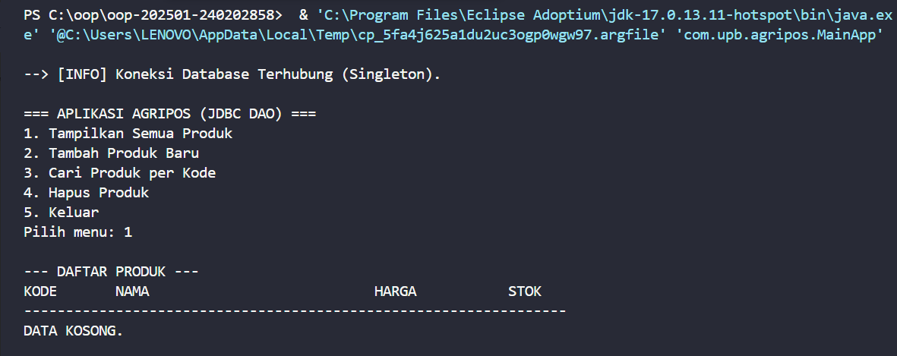
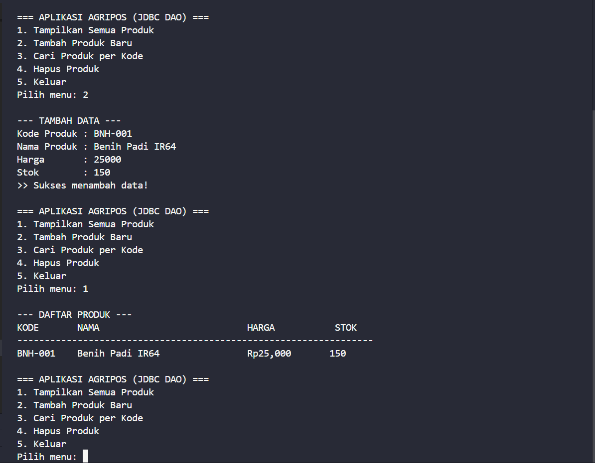
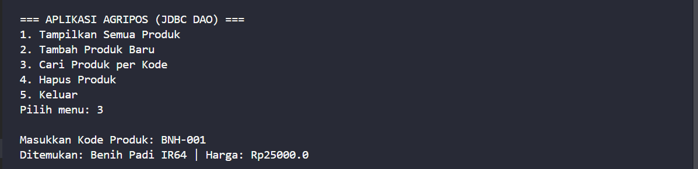
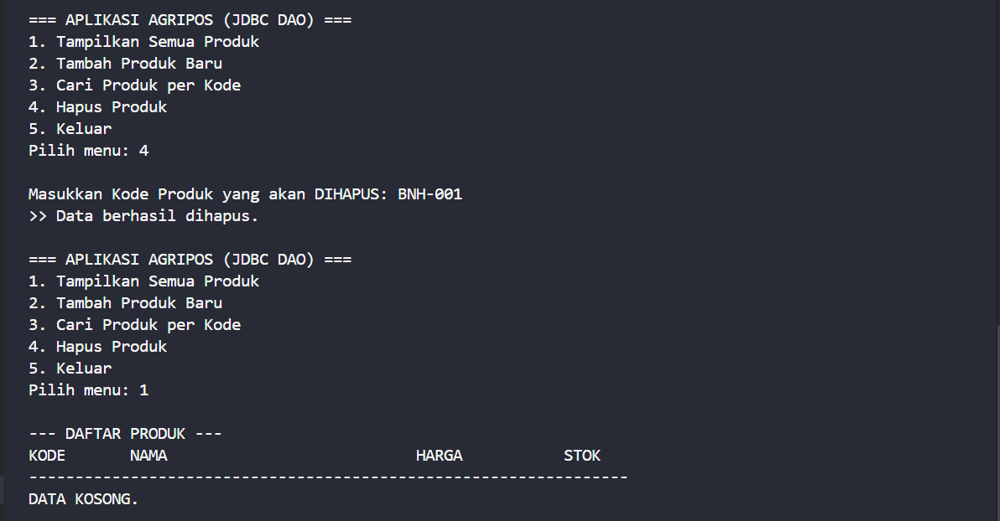

# Laporan Praktikum Minggu 11
Topik: Data Access Object (DAO) dan CRUD Database dengan JDBC

## Identitas
- **Nama** : Dimas Wahyu Pratama
- **NIM** : 240202858
- **Kelas** : 3IKRA

---

## Tujuan
1. Mahasiswa mampu menghubungkan aplikasi Java dengan basis data **PostgreSQL** menggunakan **JDBC Driver**.
2. Mahasiswa mampu mengimplementasikan pola desain **Data Access Object (DAO)** untuk memisahkan logika bisnis dari akses data.
3. Mahasiswa mampu membuat aplikasi interaktif yang melakukan operasi **CRUD** (Create, Read, Update, Delete) secara lengkap.
4. Mahasiswa mampu menerapkan **Singleton Pattern** pada koneksi database untuk efisiensi resource.

---

## Dasar Teori
1. **JDBC (Java Database Connectivity)**: Standar API di Java yang memungkinkan aplikasi untuk berinteraksi dengan berbagai jenis basis data relasional. Komponen utamanya meliputi `DriverManager`, `Connection`, `PreparedStatement`, dan `ResultSet`.
2. **Data Access Object (DAO)**: Pola desain yang menyediakan antarmuka abstrak ke semacam database atau mekanisme persistensi lain. Tujuannya adalah memisahkan kode akses data (SQL) dari logika bisnis aplikasi.
3. **PreparedStatement**: Fitur JDBC untuk mengeksekusi query SQL yang sudah dikompilasi sebelumnya. Ini lebih aman dari serangan *SQL Injection* dibandingkan `Statement` biasa.
4. **PostgreSQL**: Sistem manajemen basis data relasional objek (ORDBMS) open source yang kuat, yang digunakan sebagai penyimpanan data dalam praktikum ini.

---

## Langkah Praktikum
1. **Persiapan Database**: Membuat database `agripos` dan tabel `products` pada PostgreSQL menggunakan pgAdmin 4.
2. **Konfigurasi Maven**: Menambahkan dependency `postgresql` (driver JDBC) pada file `pom.xml`.
3. **Implementasi Singleton Database**: Membuat class `DatabaseConnection.java` yang menerapkan Singleton Pattern agar koneksi database terpusat dan efisien.
4. **Implementasi DAO**:
   - Membuat interface `ProductDAO` sebagai kontrak metode.
   - Membuat class `ProductDAOImpl` yang berisi logika query SQL (CRUD) menggunakan `PreparedStatement`.
5. **Integrasi Aplikasi (MainDAOTest.java)**: Membuat class `MainDAOTest.java` berbasis menu interaktif (*console based*) menggunakan `Scanner` untuk memanggil fungsi-fungsi DAO sesuai input pengguna.

---

## Kode Program
```java
// DatabaseConnection.java
package com.upb.agripos.config;

import java.sql.Connection;
import java.sql.DriverManager;
import java.sql.SQLException;

public class DatabaseConnection {
    private static Connection connection;

    private static final String URL = "jdbc:postgresql://localhost:5432/agripos";
    private static final String USER = "postgres";
    private static final String PASSWORD = "admin123"; 

    // Constructor Private (Wajib untuk Singleton)
    private DatabaseConnection() {}

    public static Connection getConnection() {
        try {
            if (connection == null || connection.isClosed()) {
                // Opsional: Load driver manual untuk memastikan
                try {
                    Class.forName("org.postgresql.Driver");
                } catch (ClassNotFoundException e) {
                    System.err.println("Driver PostgreSQL tidak ditemukan!");
                }
                
                connection = DriverManager.getConnection(URL, USER, PASSWORD);
                System.out.println("--> [INFO] Koneksi Database Terhubung (Singleton).");
            }
        } catch (SQLException e) {
            System.err.println("Gagal konek database: " + e.getMessage());
        }
        return connection;
    }
}
```
```java
// ProductDAO.java
package com.upb.agripos.dao;

import java.util.List;

import com.upb.agripos.model.Product;

public interface ProductDAO {
    void insert(Product product) throws Exception;
    Product findByCode(String code) throws Exception;
    List<Product> findAll() throws Exception;
    void update(Product product) throws Exception;
    void delete(String code) throws Exception;
}
```
```java
// ProductDAOImpl.java
package com.upb.agripos.dao;

import java.sql.Connection;
import java.sql.PreparedStatement;
import java.sql.ResultSet;
import java.util.ArrayList;
import java.util.List; 

import com.upb.agripos.config.DatabaseConnection;
import com.upb.agripos.model.Product;

public class ProductDAOImpl implements ProductDAO {

    private final Connection connection;

    public ProductDAOImpl() {
        // Ambil koneksi otomatis dari Singleton
        this.connection = DatabaseConnection.getConnection();
    }

    @Override
    public void insert(Product p) throws Exception {
        String sql = "INSERT INTO products(code, name, price, stock) VALUES (?, ?, ?, ?)";
        try (PreparedStatement ps = connection.prepareStatement(sql)) {
            ps.setString(1, p.getCode());
            ps.setString(2, p.getName());
            ps.setDouble(3, p.getPrice());
            ps.setInt(4, p.getStock());
            ps.executeUpdate();
        }
    }

    @Override
    public Product findByCode(String code) throws Exception {
        String sql = "SELECT * FROM products WHERE code = ?";
        try (PreparedStatement ps = connection.prepareStatement(sql)) {
            ps.setString(1, code);
            try (ResultSet rs = ps.executeQuery()) {
                if (rs.next()) {
                    return new Product(
                        rs.getString("code"),
                        rs.getString("name"),
                        rs.getDouble("price"),
                        rs.getInt("stock")
                    );
                }
            }
        }
        return null;
    }

    @Override
    public List<Product> findAll() throws Exception {
        List<Product> list = new ArrayList<>();
        String sql = "SELECT * FROM products ORDER BY code ASC"; 
        try (PreparedStatement ps = connection.prepareStatement(sql);
             ResultSet rs = ps.executeQuery()) {
            while (rs.next()) {
                list.add(new Product(
                    rs.getString("code"),
                    rs.getString("name"),
                    rs.getDouble("price"),
                    rs.getInt("stock")
                ));
            }
        }
        return list;
    }

    @Override
    public void update(Product p) throws Exception {
        String sql = "UPDATE products SET name=?, price=?, stock=? WHERE code=?";
        try (PreparedStatement ps = connection.prepareStatement(sql)) {
            ps.setString(1, p.getName());
            ps.setDouble(2, p.getPrice());
            ps.setInt(3, p.getStock());
            ps.setString(4, p.getCode());
            ps.executeUpdate();
        }
    }

    @Override
    public void delete(String code) throws Exception {
        String sql = "DELETE FROM products WHERE code=?";
        try (PreparedStatement ps = connection.prepareStatement(sql)) {
            ps.setString(1, code);
            ps.executeUpdate();
        }
    }
}
```
```java
// Product.java
package com.upb.agripos.model;

public class Product {
    private String code;
    private String name;
    private double price;
    private int stock;

    public Product(String code, String name, double price, int stock) {
        this.code = code;
        this.name = name;
        this.price = price;
        this.stock = stock;
    }

    // Getter
    public String getCode() { return code; }
    public String getName() { return name; }
    public double getPrice() { return price; }
    public int getStock() { return stock; }

    // Setter
    public void setName(String name) { this.name = name; }
    public void setPrice(double price) { this.price = price; }
    public void setStock(int stock) { this.stock = stock; }
}
```
```java
// MainDAOTest.java
package com.upb.agripos;

import java.util.List;
import java.util.Scanner;

import com.upb.agripos.dao.ProductDAO;
import com.upb.agripos.dao.ProductDAOImpl;
import com.upb.agripos.model.Product;

public class MainDAOTest {
    private static final Scanner scanner = new Scanner(System.in);
    
    private static final ProductDAO dao = new ProductDAOImpl();

    public static void main(String[] args) {
        int pilihan = 0;
        
        while (pilihan != 5) {
            System.out.println("\n=== APLIKASI AGRIPOS (JDBC DAO) ===");
            System.out.println("1. Tampilkan Semua Produk");
            System.out.println("2. Tambah Produk Baru");
            System.out.println("3. Cari Produk per Kode");
            System.out.println("4. Hapus Produk");
            System.out.println("5. Keluar");
            System.out.print("Pilih menu: ");
            
            try {
                String input = scanner.nextLine();
                // Validasi input kosong
                if (input.isEmpty()) continue;
                
                pilihan = Integer.parseInt(input);
                
                switch (pilihan) {
                    case 1 -> showAllProducts();
                    case 2 -> insertProduct();
                    case 3 -> findProduct();
                    case 4 -> deleteProduct();
                    case 5 -> System.out.println("Terima kasih! Menutup aplikasi...");
                    default -> System.out.println("Pilihan tidak valid.");
                }
            } catch (NumberFormatException e) {
                System.out.println("Input harus angka!");
            } catch (Exception e) {
                System.out.println("Terjadi Error: " + e.getMessage());
                e.printStackTrace();
            }
        }
    }

    private static void showAllProducts() throws Exception {
        List<Product> list = dao.findAll();
        System.out.println("\n--- DAFTAR PRODUK ---");
        System.out.printf("%-10s %-30s %-15s %-10s\n", "KODE", "NAMA", "HARGA", "STOK");
        System.out.println("-----------------------------------------------------------------");
        
        if (list.isEmpty()) {
            System.out.println("DATA KOSONG.");
        } else {
            for (Product p : list) {
                System.out.printf("%-10s %-30s Rp%,-12.0f %-10d\n", 
                    p.getCode(), p.getName(), p.getPrice(), p.getStock());
            }
        }
    }

    private static void insertProduct() throws Exception {
        System.out.println("\n--- TAMBAH DATA ---");
        System.out.print("Kode Produk : ");
        String code = scanner.nextLine();
        
        // Cek dulu apakah kode sudah ada (Validasi sederhana)
        if (dao.findByCode(code) != null) {
            System.out.println("GAGAL: Kode produk " + code + " sudah ada!");
            return;
        }

        System.out.print("Nama Produk : ");
        String name = scanner.nextLine();
        System.out.print("Harga       : ");
        double price = Double.parseDouble(scanner.nextLine());
        System.out.print("Stok        : ");
        int stock = Integer.parseInt(scanner.nextLine());

        Product p = new Product(code, name, price, stock);
        dao.insert(p);
        System.out.println(">> Sukses menambah data!");
    }

    private static void findProduct() throws Exception {
        System.out.print("\nMasukkan Kode Produk: ");
        String code = scanner.nextLine();
        Product p = dao.findByCode(code);
        
        if (p != null) {
            System.out.println("Ditemukan: " + p.getName() + " | Harga: Rp" + p.getPrice());
        } else {
            System.out.println("Produk tidak ditemukan.");
        }
    }

    private static void deleteProduct() throws Exception {
        System.out.print("\nMasukkan Kode Produk yang akan DIHAPUS: ");
        String code = scanner.nextLine();
        
        if (dao.findByCode(code) == null) {
            System.out.println("Data tidak ditemukan, gagal hapus.");
        } else {
            dao.delete(code);
            System.out.println(">> Data berhasil dihapus.");
        }
    }
}
```
---

## Hasil Eksekusi

Berikut adalah bukti bahwa seluruh operasi CRUD berjalan sukses pada aplikasi Console Menu:

**1. Tampilan Awal & Menu Utama (Read Empty)**
Saat aplikasi pertama dijalankan, data masih kosong.


**2. Tambah Data Baru (Create) & Tampilkan (Read)**
Berhasil menambahkan produk "Benih Padi IR64" dan menampilkannya di tabel.


**3. Pencarian Data Spesifik (Read by ID)**
Mencari produk berdasarkan kode "BNH-001" berhasil ditemukan.


**4. Hapus Data (Delete) & Verifikasi**
Menghapus produk "BNH-001", dan saat dicek kembali, data sudah hilang (Kosong).


---

## Analisis (Poin Plus)

Pada praktikum ini, saya melakukan pengembangan kode (*refactoring*) dari modul standar untuk memenuhi prinsip **Object-Oriented Programming (OOP)** dan **Clean Code** yang lebih baik:

1.  **Penerapan Singleton Pattern pada Koneksi Database**:
    Berbeda dengan modul yang membuat koneksi langsung di `main`, saya memisahkannya ke class `DatabaseConnection`. Hal ini memastikan aplikasi hanya membuka satu koneksi ke database (hemat memori) dan mempermudah pemeliharaan jika password/user database berubah.

2.  **Integrasi DAO dengan Aplikasi Interaktif**:
    Saya mengubah `MainApp` menjadi aplikasi berbasis menu (*Command Line Interface*). Hal ini membuktikan integrasi yang kuat antara lapisan antarmuka (UI) dan lapisan data (DAO). `MainApp` tidak mengandung kode SQL sedikitpun, melainkan hanya memanggil metode abstrak dari DAO (`dao.insert()`, `dao.findAll()`).

3.  **Keamanan dengan PreparedStatement**:
    Seluruh operasi database menggunakan `PreparedStatement` untuk mencegah error sintaks SQL akibat input user yang mengandung karakter khusus dan mencegah risiko *SQL Injection*.

---

## Kesimpulan
Penerapan **Data Access Object (DAO)** sangat penting dalam pengembangan aplikasi berskala besar karena memisahkan logika aplikasi dari detail teknis penyimpanan data. Dengan menggabungkan DAO, JDBC, dan Singleton Pattern, aplikasi menjadi lebih modular, mudah dites, aman, dan efisien dalam penggunaan sumber daya database.

---

## Quiz (Latihan Pemahaman)

1.  **Mengapa kita menggunakan `PreparedStatement` daripada `Statement` biasa?**
    Karena `PreparedStatement` melakukan pre-kompilasi query SQL sehingga eksekusi lebih cepat untuk query berulang, serta otomatis menangani *escaping* karakter untuk mencegah serangan *SQL Injection*.

2.  **Apa fungsi `ResultSet` dalam JDBC?**
    `ResultSet` berfungsi untuk menampung hasil data (baris-baris) yang dikembalikan oleh database setelah kita mengeksekusi query `SELECT`. Kita menggunakan kursor (`rs.next()`) untuk menelusuri data tersebut.

3.  **Jelaskan keuntungan memisahkan logika koneksi (Singleton) dari logika DAO!**
    Memisahkan koneksi membuat kode DAO lebih bersih (fokus hanya pada query). Selain itu, jika konfigurasi database berubah (misal ganti password), kita cukup mengubah satu file (`DatabaseConnection`) tanpa harus mengedit seluruh file DAO.