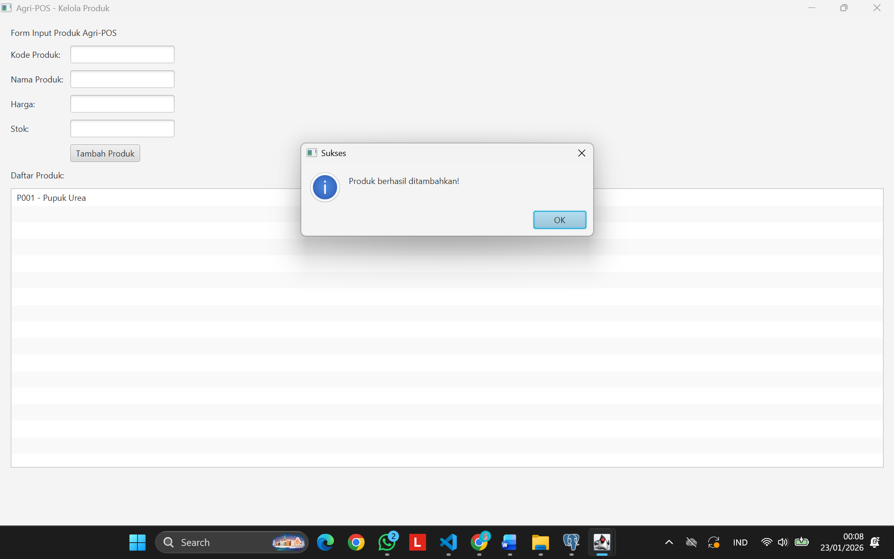

# Laporan Praktikum Minggu 12
Topik: GUI Dasar JavaFX (Event-Driven Programming)

## Identitas
- **Nama** : Dimas Wahyu Pratama
- **NIM** : 240202858
- **Kelas** : 3IKRA

---

## Tujuan
1. Mahasiswa mampu memahami konsep *Event-Driven Programming* pada aplikasi desktop.
2. Mahasiswa mampu membangun antarmuka grafis (GUI) sederhana menggunakan JavaFX.
3. Mahasiswa mampu mengintegrasikan form input GUI dengan backend (Service & DAO) yang telah dibuat sebelumnya.

---

## Dasar Teori
1. **JavaFX**
   Platform perangkat lunak untuk membuat dan mengirimkan aplikasi desktop serta aplikasi internet kaya (RIA) yang dapat berjalan di berbagai perangkat. JavaFX menggantikan Swing sebagai standar library GUI di Java.

2. **Event-Driven Programming**
   Paradigma pemrograman di mana alur program ditentukan oleh *event* (peristiwa) seperti klik tombol, input keyboard, atau pesan dari sistem. Kode program "menunggu" aksi dari pengguna sebelum menjalankan logika tertentu.

3. **MVC (Model-View-Controller)**
   Pola arsitektur yang memisahkan aplikasi menjadi tiga komponen utama:
   - **Model**: Merepresentasikan data dan aturan bisnis (Product).
   - **View**: Menangani tampilan antarmuka kepada pengguna (Form GUI).
   - **Controller**: Mengatur alur logika dan menghubungkan View dengan Model.

4. **Dependency Injection**
   Teknik desain di mana sebuah objek menerima objek lain yang dibutuhkannya. Dalam praktikum ini, `ProductController` menerima `ProductService` melalui konstruktor untuk menghindari ketergantungan yang kaku (*hard dependency*).

---

## Langkah Praktikum
1. **Konfigurasi `pom.xml`**: 
   Menambahkan dependency `javafx-controls`, `javafx-fxml`, dan plugin `javafx-maven-plugin` agar project mendukung JavaFX.
   
2. **Pembuatan View (`ProductFormView.java`)**: 
   Membuat tampilan form input produk dan list view menggunakan komponen JavaFX seperti `GridPane` (untuk tata letak), `TextField` (input), dan `Button`.

3. **Pembuatan Service (`ProductService.java`)**: 
   Membuat layer logika bisnis yang menghubungkan Controller dengan DAO. Di sini ditambahkan *Exception Handling* (`try-catch`) untuk menangkap error dari database.

4. **Pembuatan Controller (`ProductController.java`)**: 
   Mengimplementasikan *event handler* pada tombol "Tambah Produk". Controller bertugas menangkap input dari View, memvalidasi tipe data, dan memanggil Service.

5. **Pembuatan Workaround (`Launcher.java`)**: 
   Membuat kelas pemancing (*wrapper*) untuk mengatasi error *"JavaFX runtime components are missing"* saat dijalankan melalui VS Code.

6. **Integrasi & Pengujian**: 
   Menjalankan aplikasi, melakukan uji coba input data valid dan invalid, serta memverifikasi data masuk ke database PostgreSQL.

7. **Commit Git**:
   Melakukan commit dengan pesan: `week12-gui-dasar: [fitur] membuat form input produk dan integrasi backend`.

---

## Kode Program
### 1. View (ProductFormView.java)
```java
package com.upb.agripos.view;

import javafx.geometry.Insets;
import javafx.scene.Parent;
import javafx.scene.control.Button;
import javafx.scene.control.Label;
import javafx.scene.control.ListView;
import javafx.scene.control.TextField;
import javafx.scene.layout.GridPane;
import javafx.scene.layout.VBox;

public class ProductFormView {
    // Komponen UI diekspos agar bisa diakses Controller
    private TextField txtCode = new TextField();
    private TextField txtName = new TextField();
    private TextField txtPrice = new TextField();
    private TextField txtStock = new TextField();
    private Button btnAdd = new Button("Tambah Produk");
    private ListView<String> listView = new ListView<>();

    public Parent asParent() {
        VBox root = new VBox(10);
        root.setPadding(new Insets(15));

        // Form Input menggunakan GridPane
        GridPane formGrid = new GridPane();
        formGrid.setHgap(10);
        formGrid.setVgap(10);

        formGrid.add(new Label("Kode Produk:"), 0, 0);
        formGrid.add(txtCode, 1, 0);
        formGrid.add(new Label("Nama Produk:"), 0, 1);
        formGrid.add(txtName, 1, 1);
        formGrid.add(new Label("Harga:"), 0, 2);
        formGrid.add(txtPrice, 1, 2);
        formGrid.add(new Label("Stok:"), 0, 3);
        formGrid.add(txtStock, 1, 3);
        formGrid.add(btnAdd, 1, 4);

        // Menambahkan elemen ke root container
        root.getChildren().addAll(
            new Label("Form Input Produk Agri-POS"),
            formGrid,
            new Label("Daftar Produk:"),
            listView
        );

        return root;
    }

    // Getter untuk komponen UI
    public TextField getTxtCode() { return txtCode; }
    public TextField getTxtName() { return txtName; }
    public TextField getTxtPrice() { return txtPrice; }
    public TextField getTxtStock() { return txtStock; }
    public Button getBtnAdd() { return btnAdd; }
    public ListView<String> getListView() { return listView; }
}
```
### 2. Controller (ProductController.java)
```java
package com.upb.agripos.controller;

import com.upb.agripos.model.Product;
import com.upb.agripos.service.ProductService;
import com.upb.agripos.view.ProductFormView;

import javafx.scene.control.Alert;

public class ProductController {
    private ProductFormView view;
    private ProductService service;

    public ProductController(ProductFormView view, ProductService service) {
        this.view = view;
        this.service = service;
        
        // Mendaftarkan Event Handler
        this.view.getBtnAdd().setOnAction(e -> addProduct());
        
        // Load data awal (opsional)
        refreshList();
    }

    private void addProduct() {
        try {
            // 1. Ambil data dari View
            String code = view.getTxtCode().getText();
            String name = view.getTxtName().getText();
            double price = Double.parseDouble(view.getTxtPrice().getText());
            int stock = Integer.parseInt(view.getTxtStock().getText());

            // 2. Bungkus ke Model
            Product p = new Product(code, name, price, stock);

            // 3. Panggil Service (Backend)
            service.insert(p);

            // 4. Update View (Feedback ke user)
            refreshList();
            clearForm();
            showAlert("Sukses", "Produk berhasil ditambahkan!");

        } catch (NumberFormatException e) {
            showAlert("Error", "Harga dan Stok harus angka!");
        } catch (Exception e) {
            showAlert("Error", "Gagal menyimpan: " + e.getMessage());
        }
    }

    private void refreshList() {
        view.getListView().getItems().clear();
        for (Product p : service.getAllProducts()) {
            view.getListView().getItems().add(p.getCode() + " - " + p.getName());
        }
    }

    private void clearForm() {
        view.getTxtCode().clear();
        view.getTxtName().clear();
        view.getTxtPrice().clear();
        view.getTxtStock().clear();
    }

    private void showAlert(String title, String content) {
        Alert alert = new Alert(Alert.AlertType.INFORMATION);
        alert.setTitle(title);
        alert.setHeaderText(null);
        alert.setContentText(content);
        alert.showAndWait();
    }
}
```
### 3. Service (ProductService.java)
```java
package com.upb.agripos.service;

import java.util.List;

import com.upb.agripos.dao.ProductDAO;
import com.upb.agripos.model.Product;

public class ProductService {
    private ProductDAO productDAO;

    public ProductService(ProductDAO productDAO) {
        this.productDAO = productDAO;
    }

    public void insert(Product product) {
        try {
            // SOLUSI ERROR 1: Bungkus dengan try-catch
            productDAO.insert(product); 
        } catch (Exception e) {
            e.printStackTrace(); // Tampilkan error di console jika gagal
            // Opsional: Lempar ulang sebagai RuntimeException biar Controller tahu
            throw new RuntimeException("Gagal menyimpan produk: " + e.getMessage());
        }
    }

    public List<Product> getAllProducts() {
        try {
            return productDAO.findAll(); 
        } catch (Exception e) {
            e.printStackTrace();
            return List.of(); // Kembalikan list kosong jika error
        }
    }
}
```
### 4. Main Class (AppJavaFX.java)
```java
package com.upb.agripos;

import com.upb.agripos.dao.ProductDAO;
import com.upb.agripos.service.ProductService;
import com.upb.agripos.view.ProductFormView;
import com.upb.agripos.controller.ProductController;
import javafx.application.Application;
import javafx.scene.Scene;
import javafx.stage.Stage;

public class AppJavaFX extends Application {

    @Override
    public void start(Stage stage) {
        // 1. Inisialisasi Backend (DAO & Service)
        // Pastikan ProductDAO kamu punya implementasi koneksi DB yang benar dari Week 11
        ProductDAO dao = new com.upb.agripos.dao.ProductDAOImpl(); 
        ProductService service = new ProductService(dao);

        // 2. Inisialisasi View
        ProductFormView view = new ProductFormView();

        // 3. Inisialisasi Controller (Binding View & Service)
        new ProductController(view, service);

        // 4. Tampilkan Scene
        Scene scene = new Scene(view.asParent(), 400, 500);
        stage.setTitle("Agri-POS - Kelola Produk");
        stage.setScene(scene);
        stage.show();
    }

    public static void main(String[] args) {
        launch(args);
    }
}
```
---

## Hasil Eksekusi

Berikut adalah tampilan aplikasi saat berhasil menambahkan data produk "P001 - Pupuk Urea". Data berhasil disimpan ke database dan ditampilkan kembali pada list.



---

## Analisis

### 1. Analisis Alur Program
Program berjalan menggunakan konsep MVC yang ketat:
* Saat aplikasi dimulai, `AppJavaFX` memuat tampilan dari `ProductFormView`.
* Ketika pengguna mengisi form dan menekan tombol "Tambah", `ProductController` menangkap *event* tersebut.
* Controller mengambil teks dari `TextField`, melakukan validasi (memastikan Harga/Stok adalah angka), lalu membungkus data menjadi objek `Product`.
* Objek ini dikirim ke `ProductService`, yang kemudian meneruskannya ke `ProductDAO` untuk query `INSERT` ke database PostgreSQL.
* Jika sukses, Controller membersihkan form dan memperbarui `ListView` dengan data terbaru.

### 2. Traceability (Kesesuaian dengan Desain Bab 6)
Implementasi kode pada minggu ini telah sesuai dengan rancangan desain sistem sebelumnya:

| Artefak Bab 6 | Referensi | Handler GUI | Controller/Service | DAO | Dampak UI/DB |
|---|---|---|---|---|---|
| Use Case | UC-01 Tambah Produk | Tombol Tambah | `ProductController.addProduct()` → `ProductService.insert()` | `ProductDAO.insert()` | UI list bertambah + Data masuk DB |
| Activity | AD-01 Tambah Produk | `btnAdd.setOnAction` | Validasi input (`try-catch`) → Panggil Service | - | Jika validasi gagal, muncul Alert Error |
| Sequence | SD-01 Tambah Produk | User klik Tombol | View → Controller → Service | DAO → DB | Urutan panggilan objek sesuai SD |

### 3. Kendala dan Solusi
Selama praktikum, terdapat kendala teknis yaitu error *"JavaFX runtime components are missing"* saat menjalankan aplikasi melalui tombol Run standar di VS Code.

* **Analisis:** Hal ini terjadi karena JavaFX versi terbaru bersifat modular dan tidak otomatis dimuat oleh JDK default tanpa konfigurasi *VM arguments*.
* **Solusi:** Saya membuat kelas bantuan bernama `Launcher.java` yang berisi `main method` sederhana untuk memanggil `AppJavaFX.main()`. Teknik ini memaksa JVM untuk memuat seluruh library yang diperlukan (termasuk JavaFX) sebelum aplikasi utama dieksekusi, sehingga aplikasi dapat berjalan lancar tanpa konfigurasi rumit.

---

## Kesimpulan
Praktikum minggu ini berhasil mencapai tujuan untuk mengimplementasikan antarmuka grafis (GUI) pada aplikasi Agri-POS. Penggunaan JavaFX dengan pola desain MVC terbukti membuat struktur kode lebih rapi dan mudah dikelola (*maintainable*). Integrasi antara Frontend (GUI) dan Backend (DAO/Service) berjalan mulus, membuktikan bahwa logika bisnis yang dibuat pada minggu sebelumnya bersifat *reusable* dan independen dari tampilannya.