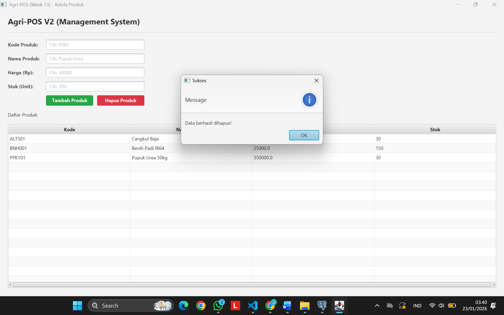

# Laporan Praktikum Minggu 13
Topik: GUI Lanjutan JavaFX (TableView dan Lambda Expression)

## Identitas
- **Nama** : Dimas Wahyu Pratama
- **NIM** : 240202858
- **Kelas** : 3IKRA

---

## Tujuan
1. Mahasiswa mampu menampilkan data dari database dalam bentuk tabel (*TableView*) yang terstruktur.
2. Mahasiswa mampu menerapkan *Lambda Expression* untuk menyederhanakan penulisan *Event Handler*.
3. Mahasiswa mampu mengimplementasikan fitur "Hapus Data" yang terintegrasi penuh dari GUI hingga Database (DAO).
4. Mahasiswa mampu meningkatkan estetika antarmuka (UI) menggunakan CSS sederhana untuk pengalaman pengguna (UX) yang lebih baik.

---

## Dasar Teori
1. **TableView JavaFX**
   Komponen visual yang digunakan untuk menampilkan data dalam format baris dan kolom. Tidak seperti `ListView` yang hanya menampilkan string tunggal, `TableView` memungkinkan representasi objek kompleks di mana setiap properti objek (misal: Kode, Nama, Harga) dipetakan ke kolom tertentu.

2. **Lambda Expression**
   Fitur yang diperkenalkan pada Java 8 untuk mendukung pemrograman fungsional. Dalam konteks JavaFX, Lambda digunakan untuk mempersingkat penulisan kode *Event Handler*. 
   *Contoh:* `button.setOnAction(e -> method())` menggantikan penulisan *Anonymous Inner Class*.

3. **ObservableList**
   Jenis koleksi khusus di JavaFX yang memungkinkan komponen UI (seperti TableView) untuk secara otomatis memperbarui tampilan ketika terjadi perubahan data (penambahan atau penghapusan item) di dalam list tersebut.

---

## Langkah Praktikum
1. **Persiapan Project**: 
   Menduplikasi project Week 12 menjadi Week 13 dan menyesuaikan `pom.xml` (artifactId).

2. **Update Backend (DAO & Service)**: 
   - Memastikan `ProductDAOImpl` memiliki method `delete(String code)` untuk menghapus baris di PostgreSQL.
   - Menambahkan method `delete()` pada `ProductService` sebagai jembatan logika bisnis.

3. **Implementasi View (`ProductTableView.java`)**: 
   - Mengganti komponen `ListView` dengan `TableView`.
   - Mendefinisikan kolom (`TableColumn`) dan menghubungkannya dengan properti model `Product`.
   - Menambahkan tombol "Hapus Produk".
   - **Peningkatan UI**: Menerapkan styling CSS untuk memberi warna Hijau (Tambah) dan Merah (Hapus), serta merapikan layout menggunakan `HBox`.

4. **Implementasi Controller (`ProductController.java`)**: 
   - Menggunakan **Lambda Expression** pada tombol Tambah dan Hapus.
   - Membuat logika `deleteProduct()`: Mengecek seleksi tabel, memanggil service, dan me-refresh data.

5. **Pengujian**: 
   Menjalankan aplikasi via `Launcher.java`, mencoba fitur tambah, hapus, dan memastikan data di database PostgreSQL sinkron.

6. **Commit Git**:
   Message: `week13-gui-lanjutan: [fitur] implementasi tableview, delete button, dan styling ui`

---
## Kode Program
### 1. View (ProductTableView.java)
```java
package com.upb.agripos.view;

import com.upb.agripos.model.Product;

import javafx.geometry.Insets;
import javafx.scene.Parent;
import javafx.scene.control.Button;
import javafx.scene.control.Label;
import javafx.scene.control.Separator;
import javafx.scene.control.TableColumn;
import javafx.scene.control.TableView;
import javafx.scene.control.TextField;
import javafx.scene.control.cell.PropertyValueFactory;
import javafx.scene.layout.GridPane;
import javafx.scene.layout.HBox;
import javafx.scene.layout.Priority;
import javafx.scene.layout.VBox;
import javafx.scene.text.Font;
import javafx.scene.text.FontWeight;

public class ProductTableView {
    // Komponen Form
    private TextField txtCode = new TextField();
    private TextField txtName = new TextField();
    private TextField txtPrice = new TextField();
    private TextField txtStock = new TextField();
    private Button btnAdd = new Button("Tambah Produk");
    private Button btnDelete = new Button("Hapus Produk");

    // TableView
    private TableView<Product> table = new TableView<>();

    public Parent asParent() {
        VBox root = new VBox(15); // Jarak antar elemen vertikal diperlebar (10 -> 15)
        root.setPadding(new Insets(20));
        root.setStyle("-fx-background-color: #f4f4f4;"); // Background abu muda halus

        // 1. HEADER TITLE
        Label lblTitle = new Label("Agri-POS V2 (Management System)");
        lblTitle.setFont(Font.font("Segoe UI", FontWeight.BOLD, 20));
        lblTitle.setStyle("-fx-text-fill: #333333;");

        // 2. FORM INPUT (GridPane)
        GridPane formGrid = new GridPane();
        formGrid.setHgap(15); 
        formGrid.setVgap(10);
        
        // Styling Label Form
        String labelStyle = "-fx-font-weight: bold; -fx-text-fill: #555555;";

        Label lblCode = new Label("Kode Produk:"); lblCode.setStyle(labelStyle);
        Label lblName = new Label("Nama Produk:"); lblName.setStyle(labelStyle);
        Label lblPrice = new Label("Harga (Rp):"); lblPrice.setStyle(labelStyle);
        Label lblStock = new Label("Stok (Unit):"); lblStock.setStyle(labelStyle);

        // Tambah Prompt Text (Placeholder)
        txtCode.setPromptText("Cth: P001");
        txtName.setPromptText("Cth: Pupuk Urea");
        txtPrice.setPromptText("Cth: 50000");
        txtStock.setPromptText("Cth: 100");

        formGrid.add(lblCode, 0, 0); formGrid.add(txtCode, 1, 0);
        formGrid.add(lblName, 0, 1); formGrid.add(txtName, 1, 1);
        formGrid.add(lblPrice, 0, 2); formGrid.add(txtPrice, 1, 2);
        formGrid.add(lblStock, 0, 3); formGrid.add(txtStock, 1, 3);

        // 3. TOMBOL (BUTTONS)
        // Styling Tombol Tambah (Hijau)
        btnAdd.setStyle(
            "-fx-background-color: #28a745; " + 
            "-fx-text-fill: white; " +
            "-fx-font-weight: bold; " +
            "-fx-cursor: hand;"
        );
        // Efek agar tombol terlihat sedikit lebar
        btnAdd.setPrefWidth(120);

        // Styling Tombol Hapus (Merah)
        btnDelete.setStyle(
            "-fx-background-color: #dc3545; " + 
            "-fx-text-fill: white; " +
            "-fx-font-weight: bold; " +
            "-fx-cursor: hand;"
        );
        btnDelete.setPrefWidth(120);

        // Grouping Tombol dalam HBox agar rapi bersebelahan
        HBox buttonBox = new HBox(10); // Jarak antar tombol 10px
        buttonBox.getChildren().addAll(btnAdd, btnDelete);
        
        // Menambahkan tombol ke Grid (posisi di bawah input stok)
        formGrid.add(buttonBox, 1, 4);

        // 4. SETUP TABLE
        TableColumn<Product, String> colCode = new TableColumn<>("Kode");
        colCode.setCellValueFactory(new PropertyValueFactory<>("code"));
        
        TableColumn<Product, String> colName = new TableColumn<>("Nama Produk");
        colName.setCellValueFactory(new PropertyValueFactory<>("name"));
        
        TableColumn<Product, Double> colPrice = new TableColumn<>("Harga");
        colPrice.setCellValueFactory(new PropertyValueFactory<>("price"));
        
        TableColumn<Product, Integer> colStock = new TableColumn<>("Stok");
        colStock.setCellValueFactory(new PropertyValueFactory<>("stock"));

        table.getColumns().addAll(colCode, colName, colPrice, colStock);

        // Fitur: Kolom otomatis menyesuaikan lebar layar
        table.setColumnResizePolicy(TableView.CONSTRAINED_RESIZE_POLICY);
        VBox.setVgrow(table, Priority.ALWAYS); // Tabel ngisi sisa ruang ke bawah

        // MENYATUKAN SEMUA KE ROOT
        root.getChildren().addAll(lblTitle, new Separator(), formGrid, new Label("Daftar Produk:"), table);

        return root;
    }

    // Getter Components (Tetap sama)
    public TextField getTxtCode() { return txtCode; }
    public TextField getTxtName() { return txtName; }
    public TextField getTxtPrice() { return txtPrice; }
    public TextField getTxtStock() { return txtStock; }
    public Button getBtnAdd() { return btnAdd; }
    public Button getBtnDelete() { return btnDelete; }
    public TableView<Product> getTable() { return table; }
}
```
### 2. Controller (ProductController.java)
```java
package com.upb.agripos.controller;

import com.upb.agripos.model.Product;
import com.upb.agripos.service.ProductService;
import com.upb.agripos.view.ProductTableView;

import javafx.collections.FXCollections;
import javafx.collections.ObservableList;
import javafx.scene.control.Alert;

public class ProductController {
    private ProductTableView view;
    private ProductService service;

    public ProductController(ProductTableView view, ProductService service) {
        this.view = view;
        this.service = service;

        // Event Handler Tambah (Lambda)
        this.view.getBtnAdd().setOnAction(e -> addProduct());

        // Event Handler Hapus (Lambda) - REQUIREMENT WEEK 13
        this.view.getBtnDelete().setOnAction(e -> deleteProduct());

        // Load data awal
        loadData();
    }

    private void addProduct() {
        try {
            Product p = new Product(
                view.getTxtCode().getText(),
                view.getTxtName().getText(),
                Double.parseDouble(view.getTxtPrice().getText()),
                Integer.parseInt(view.getTxtStock().getText())
            );
            service.insert(p);
            loadData(); // Refresh tabel
            clearForm();
            showAlert(Alert.AlertType.INFORMATION, "Sukses", "Data berhasil disimpan!");
        } catch (Exception e) {
            showAlert(Alert.AlertType.ERROR, "Error", e.getMessage());
        }
    }

    private void deleteProduct() {
        // Ambil item yang sedang dipilih di tabel
        Product selected = view.getTable().getSelectionModel().getSelectedItem();
        
        if (selected != null) {
            // Panggil service delete
            service.delete(selected.getCode());
            // Refresh tabel
            loadData();
            showAlert(Alert.AlertType.INFORMATION, "Sukses", "Data berhasil dihapus!");
        } else {
            showAlert(Alert.AlertType.WARNING, "Peringatan", "Pilih produk yang mau dihapus dulu!");
        }
    }

    private void loadData() {
        // Ambil list dari service, ubah jadi ObservableList buat JavaFX
        ObservableList<Product> products = FXCollections.observableArrayList(service.getAllProducts());
        view.getTable().setItems(products);
    }

    private void clearForm() {
        view.getTxtCode().clear();
        view.getTxtName().clear();
        view.getTxtPrice().clear();
        view.getTxtStock().clear();
    }

    private void showAlert(Alert.AlertType type, String title, String content) {
        Alert alert = new Alert(type);
        alert.setTitle(title);
        alert.setContentText(content);
        alert.show();
    }
}
```
### 3. Service (ProductService.java)
```java
package com.upb.agripos.service;

import java.util.List;

import com.upb.agripos.dao.ProductDAO;
import com.upb.agripos.model.Product;

public class ProductService {
    private ProductDAO productDAO;

    public ProductService(ProductDAO productDAO) {
        this.productDAO = productDAO;
    }

    public void insert(Product product) {
        try {
            productDAO.insert(product); 
        } catch (Exception e) {
            e.printStackTrace(); 
            throw new RuntimeException("Gagal menyimpan produk: " + e.getMessage());
        }
    }

    public List<Product> getAllProducts() {
        try {
            return productDAO.findAll(); 
        } catch (Exception e) {
            e.printStackTrace();
            return List.of(); // Kembalikan list kosong jika error
        }
    }

    // --- TAMBAHAN PENTING UNTUK WEEK 13 (HAPUS DATA) ---
    public void delete(String code) {
        try {
            productDAO.delete(code);
        } catch (Exception e) {
            e.printStackTrace();
            throw new RuntimeException("Gagal menghapus produk: " + e.getMessage());
        }
    }
}
```
### 4. Perubahan DAO (ProductDAO.java)
```java
package com.upb.agripos.dao;

import java.util.List;

import com.upb.agripos.model.Product;

public interface ProductDAO {
    void insert(Product product) throws Exception;
    Product findByCode(String code) throws Exception;
    List<Product> findAll() throws Exception;
    void update(Product product) throws Exception;
    void delete(String code) throws Exception;
}
```
### 5. perubahan DAO (ProductDAOImpl.java)
```java
package com.upb.agripos.dao;

import java.sql.Connection;
import java.sql.PreparedStatement;
import java.sql.ResultSet;
import java.util.ArrayList;
import java.util.List; 

import com.upb.agripos.config.DatabaseConnection;
import com.upb.agripos.model.Product;

public class ProductDAOImpl implements ProductDAO {

    private final Connection connection;

    public ProductDAOImpl() {
        // Ambil koneksi otomatis dari Singleton
        this.connection = DatabaseConnection.getConnection();
    }

    @Override
    public void insert(Product p) throws Exception {
        String sql = "INSERT INTO products(code, name, price, stock) VALUES (?, ?, ?, ?)";
        try (PreparedStatement ps = connection.prepareStatement(sql)) {
            ps.setString(1, p.getCode());
            ps.setString(2, p.getName());
            ps.setDouble(3, p.getPrice());
            ps.setInt(4, p.getStock());
            ps.executeUpdate();
        }
    }

    @Override
    public Product findByCode(String code) throws Exception {
        String sql = "SELECT * FROM products WHERE code = ?";
        try (PreparedStatement ps = connection.prepareStatement(sql)) {
            ps.setString(1, code);
            try (ResultSet rs = ps.executeQuery()) {
                if (rs.next()) {
                    return new Product(
                        rs.getString("code"),
                        rs.getString("name"),
                        rs.getDouble("price"),
                        rs.getInt("stock")
                    );
                }
            }
        }
        return null;
    }

    @Override
    public List<Product> findAll() throws Exception {
        List<Product> list = new ArrayList<>();
        // Mengurutkan berdasarkan kode agar tampilan di tabel rapi
        String sql = "SELECT * FROM products ORDER BY code ASC"; 
        try (PreparedStatement ps = connection.prepareStatement(sql);
             ResultSet rs = ps.executeQuery()) {
            while (rs.next()) {
                list.add(new Product(
                    rs.getString("code"),
                    rs.getString("name"),
                    rs.getDouble("price"),
                    rs.getInt("stock")
                ));
            }
        }
        return list;
    }

    @Override
    public void update(Product p) throws Exception {
        String sql = "UPDATE products SET name=?, price=?, stock=? WHERE code=?";
        try (PreparedStatement ps = connection.prepareStatement(sql)) {
            ps.setString(1, p.getName());
            ps.setDouble(2, p.getPrice());
            ps.setInt(3, p.getStock());
            ps.setString(4, p.getCode());
            ps.executeUpdate();
        }
    }

    @Override
    public void delete(String code) throws Exception {
        String sql = "DELETE FROM products WHERE code=?";
        try (PreparedStatement ps = connection.prepareStatement(sql)) {
            ps.setString(1, code);
            ps.executeUpdate();
        }
    }
}
```
### 6. Main Class (AppJavaFX.java)
```java
package com.upb.agripos;

import com.upb.agripos.controller.ProductController;
import com.upb.agripos.dao.ProductDAO;
import com.upb.agripos.dao.ProductDAOImpl; 
import com.upb.agripos.service.ProductService;
import com.upb.agripos.view.ProductTableView; 

import javafx.application.Application;
import javafx.scene.Scene;
import javafx.stage.Stage;

public class AppJavaFX extends Application {

    @Override
    public void start(Stage stage) {
        // 1. Inisialisasi Backend (DAO & Service)
        ProductDAO dao = new ProductDAOImpl(); 
        ProductService service = new ProductService(dao);

        // 2. Inisialisasi View (Gunakan ProductTableView untuk Week 13)
        ProductTableView view = new ProductTableView();

        // 3. Inisialisasi Controller (Binding View & Service)
        new ProductController(view, service);

        // 4. Tampilkan Scene
        Scene scene = new Scene(view.asParent(), 550, 600);
        
        stage.setTitle("Agri-POS (Week 13) - Kelola Produk");
        stage.setScene(scene);
        stage.show();
    }

    public static void main(String[] args) {
        launch(args);
    }
}
```
---

## Hasil Eksekusi

Berikut adalah tampilan aplikasi Agri-POS V2 dengan implementasi TableView dan tombol interaktif berwarna.



---

## Analisis

### 1. Analisis Alur Hapus Data
Fitur hapus bekerja dengan urutan sebagai berikut:
1.  Pengguna memilih baris produk pada `TableView`.
2.  Pengguna menekan tombol **"Hapus Produk"** (Warna Merah).
3.  `ProductController` mendeteksi *event* klik dan memeriksa apakah ada item yang dipilih menggunakan `table.getSelectionModel().getSelectedItem()`.
4.  Jika ada, Controller mengambil `code` produk tersebut dan memanggil `service.delete(code)`.
5.  Service meneruskan perintah ke `ProductDAO` untuk mengeksekusi query `DELETE FROM products...`.
6.  Setelah sukses, Controller memanggil `loadData()` untuk mengambil ulang data terbaru dari DB, sehingga baris yang dihapus hilang dari tampilan.

### 2. Peningkatan User Interface (UI/UX)
Pada praktikum ini, UI tidak lagi "flat" (abu-abu). Saya menerapkan CSS Inline untuk memberikan *visual cue* kepada pengguna:
* **Tombol Hijau**: Menandakan aksi positif/aman (Tambah).
* **Tombol Merah**: Menandakan aksi destruktif/hati-hati (Hapus).
* **Placeholder Text**: Memberikan petunjuk format input pada TextField.

Perubahan ini membuat aplikasi terasa lebih profesional dan intuitif dibandingkan sekadar fungsional.

### 3. Traceability (Kesesuaian dengan Desain Bab 6)
Berikut adalah tabel traceability update untuk Week 13:

| Artefak Bab 6 | Referensi | Handler GUI (Lambda) | Controller/Service | DAO | Dampak UI/DB |
| :--- | :--- | :--- | :--- | :--- | :--- |
| **Use Case** | UC-02 Lihat Daftar | `loadData()` (init) | `ProductController.loadData()` → `ProductService.getAllProducts()` | `ProductDAO.findAll()` | Data dari DB tampil rapi di TableView. |
| **Use Case** | UC-03 Hapus Produk | `btnDelete.setOnAction` | `ProductController.deleteProduct()` → `ProductService.delete(code)` | `ProductDAO.delete(code)` | Row terpilih dihapus dari DB, tabel direfresh. |
| **Sequence** | SD-02 Hapus Produk | User klik tombol Hapus | View → Controller (Cek seleksi) → Service → DAO | DAO eksekusi DELETE SQL | UI sinkron dengan kondisi DB terbaru. |

---

## Kesimpulan
Praktikum Week 13 berhasil meningkatkan fungsionalitas aplikasi Agri-POS secara signifikan. Penggunaan `TableView` memberikan representasi data yang jauh lebih informatif dibandingkan `ListView`. Penerapan *Lambda Expression* terbukti membuat kode Controller lebih ringkas dan mudah dibaca. Selain itu, integrasi fitur CRUD (*Create, Read, Delete*) kini telah lengkap menghubungkan antarmuka pengguna JavaFX dengan database PostgreSQL secara *real-time*. Peningkatan estetika UI juga berhasil memberikan pengalaman penggunaan yang lebih baik.