# Laporan Praktikum Minggu 14
Topik: Integrasi Individu (Agri-POS)

## Identitas
- Nama  : Dimas Wahyu Pratama
- NIM   : 240202858
- Kelas : 3IKRA

---

## 1. Ringkasan Aplikasi
**Agri-POS** adalah aplikasi Point of Sale (Kasir) sederhana yang dirancang untuk toko pertanian. Aplikasi ini dibangun menggunakan JavaFX (GUI) dan PostgreSQL (Database) dengan arsitektur **MVC (Model-View-Controller) + Service + DAO**.

Fitur utama aplikasi meliputi:
1.  **Transaksi Penjualan:** Pencarian produk, input jumlah, perhitungan subtotal, dan pembayaran (Tunai/E-Wallet) dengan kalkulasi kembalian otomatis.
2.  **Manajemen Diskon (Double Discount):**
    * Diskon Member/Voucher (Validasi via Database).
    * Diskon Threshold (Otomatis potong 5% jika belanja > Rp 500.000).
3.  **Retur Barang:** Fitur pengembalian barang berdasarkan ID Transaksi yang secara otomatis mengembalikan stok ke gudang.
4.  **Manajemen Produk (CRUD):** Admin dapat menambah, mengubah, dan menghapus data produk.
5.  **Laporan Penjualan:** Rekapitulasi riwayat transaksi yang tersimpan di database.
6.  **Struk Digital:** Simulasi cetak struk menggunakan Pop-up Dialog.

---

## 2. Keterangan Integrasi Bab 1–13
Aplikasi ini mengintegrasikan materi dari pertemuan sebelumnya:

* **Bab 1 (Identitas):** Menampilkan log `Hello World, I am [Nama]-[NIM]` saat aplikasi dimulai.
* **Bab 2-5 (OOP Core):** Penggunaan Class `Product`, `Transaction`, `CartItem` dengan penerapan Encapsulation (getter/setter) dan Polymorphism (pada metode pembayaran).
* **Bab 6 (UML & SOLID):** Struktur kode dipisah berdasarkan layer (`View`, `Controller`, `Service`, `DAO`) untuk memenuhi prinsip *Dependency Inversion* dan *Single Responsibility*.
* **Bab 7 (Collections):** Penggunaan `List<CartItem>` untuk menampung belanjaan sementara di keranjang dan `List<Transaction>` untuk laporan.
* **Bab 9 (Exception Handling):** Validasi stok kurang, input kosong, dan penanganan error database (`SQLException`) menggunakan `try-catch` yang menampilkan Alert ke user.
* **Bab 10 (Design Pattern & Testing):**
    * **Singleton Pattern:** Digunakan pada class DatabaseConnection untuk memastikan hanya ada satu instance koneksi database yang aktif.
    * **MVC Pattern:** Digunakan secara menyeluruh dalam struktur aplikasi untuk memisahkan logika bisnis (Controller & Service), tampilan (View), dan data (Model & DAO).
    * **Integration Testing:** Menggunakan JUnit (`AgriPosIntegrationTest`) untuk menguji alur lengkap (Beli -> Cek Stok -> Retur -> Hapus Data).
* **Bab 11 (JDBC & DAO):** Akses data terpusat di `ProductDAOImpl`, `TransactionDAOImpl`, `ReturnDAO`, dan `VoucherDAO`.
* **Bab 12-13 (JavaFX):** UI interaktif menggunakan `TableView`, `GridPane`, `BorderPane`, dan Event Handling untuk tombol/input.
---

## 3. Artefak UML
Berikut adalah rancangan UML yang menjadi landasan pengembangan aplikasi Agri-POS. Rancangan ini mencakup struktur statis (Class Diagram) dan perilaku dinamis (Activity & Sequence Diagram).

### A. Use Case Diagram
Menggambarkan interaksi aktor dengan sistem.
* **Aktor:** Kasir (Fokus pada operasional) dan Admin (Fokus pada manajemen data).
* **Fitur Utama:** Mencakup `Kelola Transaksi` yang memiliki relasi *include* dengan `Proses Pembayaran` dan *extend* dengan `Terapkan Diskon`.
*(Referensi Gambar: `uml_usecase.png`)*

### B. Class Diagram (Arsitektur MVC + Strategy Pattern) [PENTING]
Diagram ini memetakan struktur paket aplikasi (`com.upb.agripos`) yang memisahkan layer secara tegas:
* **Model:** Merepresentasikan data (`Product`, `Transaction`, `Cart`).
* **View:** Menangani antarmuka JavaFX.
* **Controller:** Menghubungkan View dan Service.
* **Service & DAO:** Menangani logika bisnis dan akses database.
* **Strategy Pattern:** Terlihat pada interface `DiscountStrategy` dan `PaymentStrategy` yang diimplementasikan untuk fleksibilitas fitur diskon dan pembayaran.
*(Referensi Gambar: `uml_class.png`)*

### C. Activity Diagrams (Alur Proses)
1.  **Dashboard Kasir (Complex Flow):**
    Diagram ini mendetailkan alur transaksi yang kompleks, meliputi: validasi stok (Decision Node), validasi kode voucher, perhitungan diskon bertingkat, hingga pemilihan metode pembayaran (Tunai/QRIS).
    *(Referensi Gambar: `uml_activity_kasir.png`)*

2.  **Dashboard Admin (CRUD & Laporan):**
    Menjelaskan alur manajemen data produk (Create, Update, Delete) dan alur pengambilan data laporan penjualan dari database untuk ditampilkan ke tabel.
    *(Referensi Gambar: `uml_activity_admin.png`)*

### D. Sequence Diagrams (Interaksi Objek)
1.  **Sequence Transaksi dengan Diskon (Strategy Pattern):**
    Menunjukkan detail interaksi saat `TransactionController` memanggil `CartService`. Di sini terlihat bagaimana `DiscountStrategy` bekerja memisahkan logika diskon dari logika utama keranjang.
    *(Referensi Gambar: `sequence_transaksi_diskon.png`)*

2.  **Sequence Kelola Produk & Laporan (Admin):**
    Menunjukkan aliran data dari `MainView` -> `Controller` -> `Service` -> `DAO` -> `Database` saat Admin menyimpan produk baru atau membuka laporan harian.
    *(Referensi Gambar: `uml_sequence_admin.png`)*

3.  **Sequence Retur Barang:**
    Menggambarkan logika *restocking* otomatis. Saat retur diproses, sistem tidak hanya mencatat log, tetapi juga memanggil `ProductDAO.updateStock()` untuk mengembalikan jumlah barang.
    *(Referensi Gambar: `squence_returBarang.png`)*

---

## 4. Tabel Traceability
Tabel ini memetakan rancangan UML ke implementasi kode nyata untuk membuktikan kesesuaian desain dengan program.

| Artefak | Referensi Fitur | Handler / Trigger | Controller / Service | DAO / Model | Dampak di Sistem |
| :--- | :--- | :--- | :--- | :--- | :--- |
| **Class Diagram** | **Struktur MVC** | - | `com.upb.agripos.controller` | `com.upb.agripos.model` | Kode terorganisir rapi, View tidak akses DAO langsung. |
| **Sequence** | **Strategi Diskon** | Tombol `Hitung Total` | `CartService.calculateFinalTotal()` | `DiscountStrategy` (Interface) | Logika diskon fleksibel (Threshold / Voucher) tanpa ubah service. |
| **Activity** | **Transaksi Penjualan** | Tombol `Checkout` | `CashierController.processCheckout()` | `TransactionDAO.save()` | Data transaksi tersimpan, Stok berkurang, Struk muncul. |
| **Sequence** | **Admin CRUD** | Tombol `Simpan` Produk | `ProductController.saveProduct()` | `ProductDAO.insert()` | Validasi input, Insert ke DB PostgreSQL, Refresh tabel otomatis. |
| **Sequence** | **Retur Barang** | Tombol `Proses Retur` | `ReturnController.processReturn()` | `ReturnDAO.processReturn()` | Log retur tersimpan, **Stok produk bertambah kembali** di Gudang. |
| **Use Case** | **Cek Voucher** | Tombol `Cek` | `CashierController.handleCheckVoucher()` | `VoucherDAO.findByCode()` | Validasi kode di DB, Total harga berkurang jika valid. |
| **Use Case** | **Laporan Penjualan** | Menu `Laporan` | `ReportService.getSalesReport()` | `TransactionDAO.findAll()` | Data diambil dari DB (`JOIN` user & customer) dan tampil di Tabel. |

---

## 5. Screenshot Aplikasi (Dokumentasi Fitur)

Bagian ini mendokumentasikan implementasi antarmuka pengguna (GUI) dan alur bisnis yang telah berjalan pada aktor **Kasir**.

### A. Dashboard & Transaksi Penjualan

**1. Tampilan Awal Dashboard Kasir**
Halaman utama kasir yang bersih dan intuitif. Di sebelah kiri terdapat katalog produk yang diambil dari database, dan di sebelah kanan terdapat keranjang belanja yang masih kosong.

**2. Transaksi dengan Penerapan Diskon (Voucher)**
Implementasi fitur keranjang belanja dan strategi diskon.
* Kasir memasukkan item ke keranjang.
* Kasir memasukkan kode voucher **"MEMBER10"**.
* Sistem memvalidasi kode ke database, dan karena valid, sistem otomatis memotong total belanja sebesar 10% (Rp 50.000).
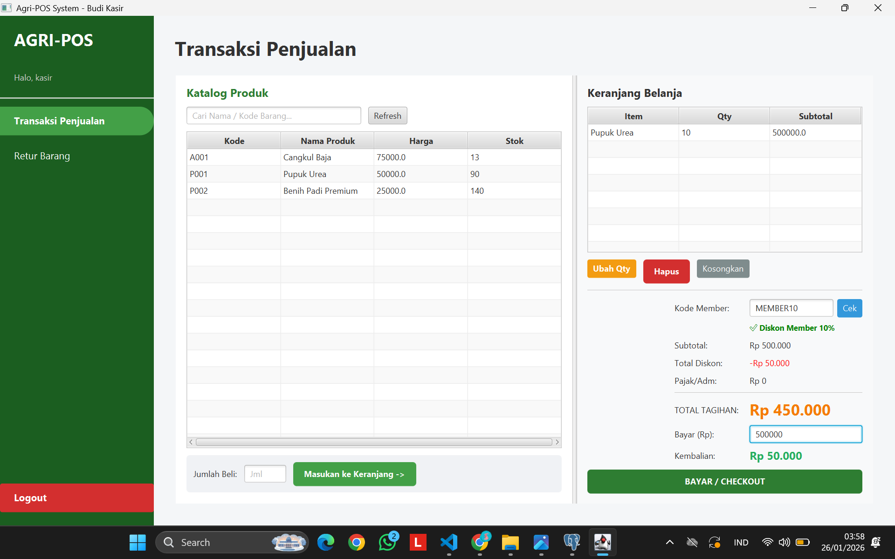

### B. Validasi & Exception Handling
Sistem dilengkapi dengan *defensive programming* untuk mencegah kesalahan data (Human Error).

**3. Validasi Stok Kurang**
Sistem mencegah kasir menambahkan jumlah barang melebihi stok yang tersedia di gudang. Pesan error muncul memberikan informasi sisa stok aktual.
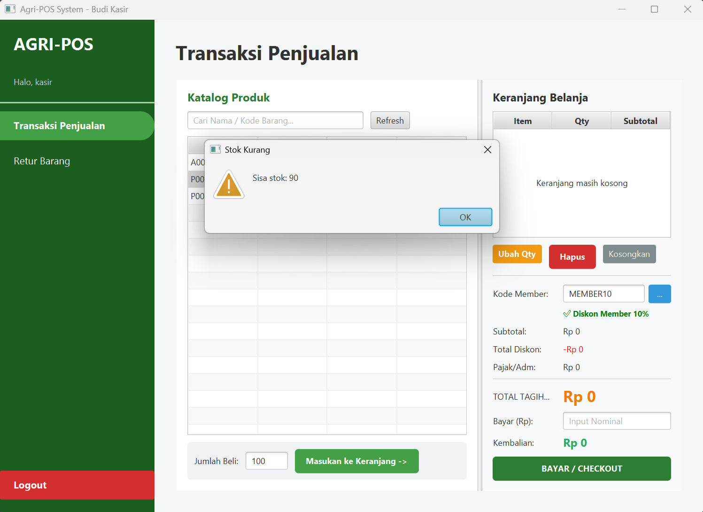

**4. Validasi Pembayaran Kurang**
Sistem menghitung uang yang dimasukkan pelanggan. Jika nominal kurang dari total tagihan, tombol "Bayar" tidak akan memproses transaksi dan menampilkan peringatan.
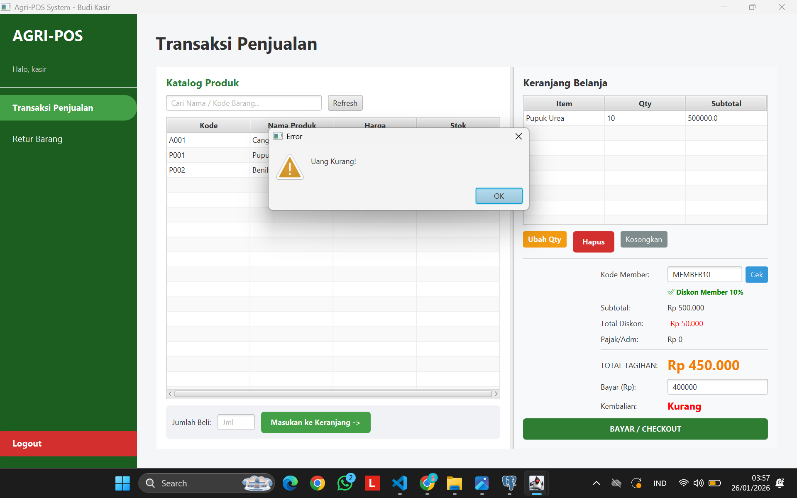

### C. Penyelesaian Transaksi

**5. Cetak Struk Digital**
Setelah pembayaran valid, sistem:
* Menyimpan data transaksi ke database (`TransactionDAO`).
* Mengurangi stok barang secara otomatis (`ProductDAO`).
* Menampilkan simulasi struk belanja dalam bentuk *Pop-up Dialog* berisi detail item, total, bayar, dan kembalian.
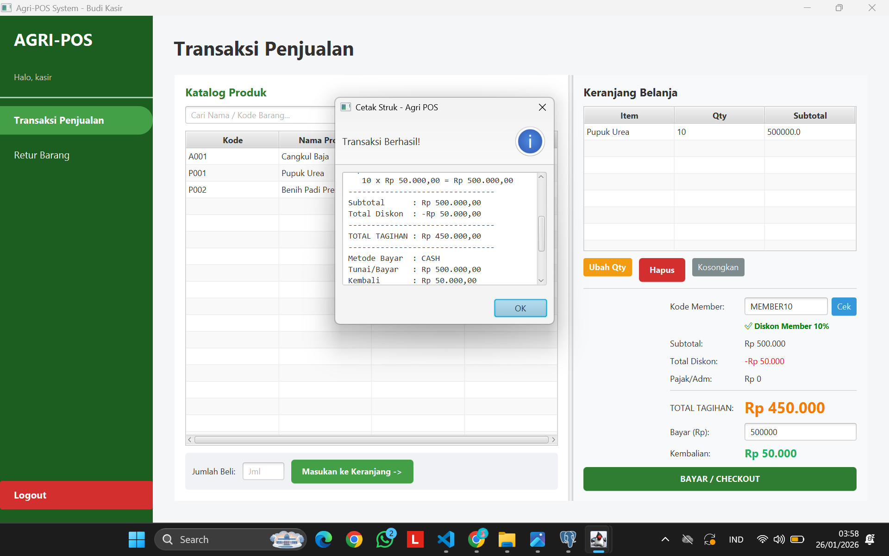

### D. Fitur Retur Barang
Fitur ini menangani pengembalian barang dari pelanggan (Restocking).

**6. Pencarian Transaksi Retur**
Kasir memasukkan Nomor Struk / ID Transaksi untuk mencari data pembelian sebelumnya. Sistem menampilkan detail barang yang dibeli pada tabel.
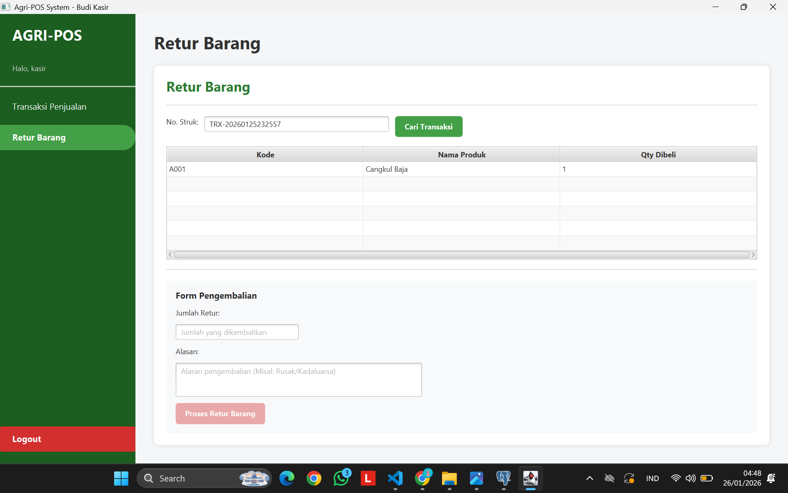

**7. Validasi ID Transaksi Tidak Ditemukan**
Jika kasir memasukkan ID Transaksi yang salah atau tidak ada di database, sistem menangani *null result* dengan menampilkan pesan peringatan yang ramah pengguna.
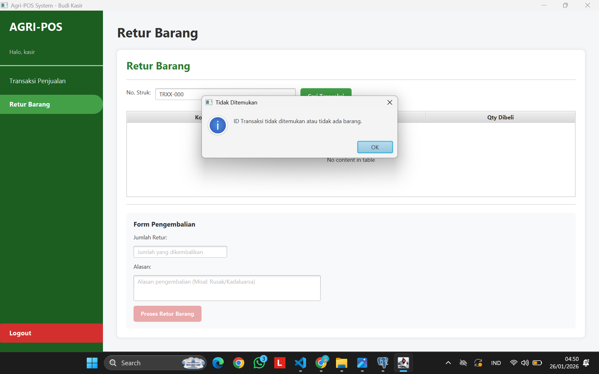

**8. Retur Berhasil (Restock Otomatis)**
Setelah item dipilih dan tombol "Proses Retur" ditekan, sistem:
* Mencatat log retur.
* **Mengembalikan stok barang** ke gudang (Stok bertambah).
* Menampilkan konfirmasi keberhasilan.
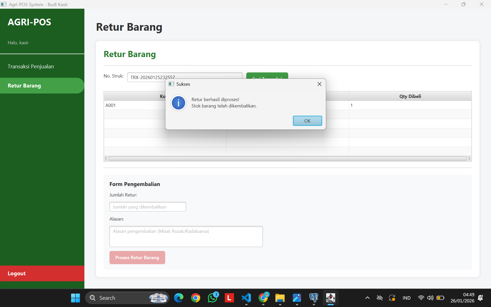

### E. Manajemen Produk (Admin Dashboard)
Bagian ini hanya dapat diakses oleh pengguna dengan role **ADMIN**. Fitur ini mengimplementasikan operasi **CRUD** *(Create, Read, Update, Delete)* secara penuh ke database PostgreSQL.

**9. Input & Kelola Produk**
Antarmuka bagi Administrator untuk mengelola data master produk. Admin dapat memasukkan Kode Produk (Validasi Unik), Nama, Harga, dan Stok Awal. Tabel di bawah secara *real-time* menampilkan data yang ada di database.
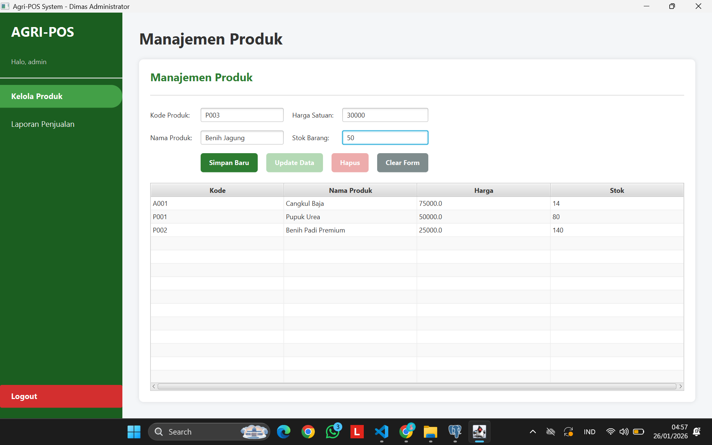

**10. Umpan Balik Sistem (CRUD Feedback)**
Sistem menerapkan prinsip *User Experience (UX)* yang baik dengan memberikan notifikasi visual (Alert Information) setiap kali operasi database berhasil dilakukan.
* **Insert Success:** Muncul saat produk baru berhasil disimpan.

* **Update Success:** Muncul saat Admin mengedit harga atau stok barang.

* **Delete Success:** Muncul saat produk dihapus dari sistem.
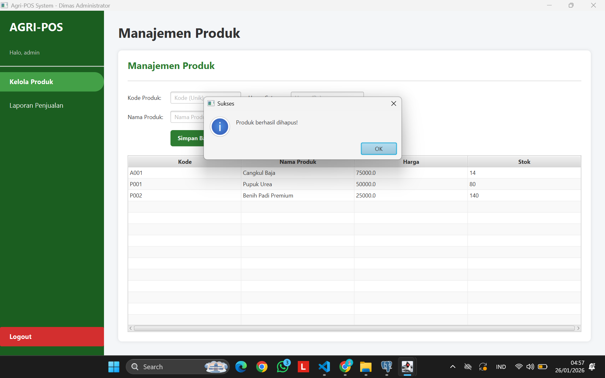

### F. Laporan Penjualan

**11. Rekapitulasi Riwayat Transaksi**
Halaman ini menampilkan seluruh data penjualan yang pernah terjadi. Data ini diambil menggunakan query SQL **`JOIN`** yang menggabungkan tabel `transactions`, `users` (untuk nama kasir), dan `customers` (untuk tipe pelanggan).
* Terdapat tombol **"Refresh Data"** untuk memuat ulang data terbaru dari server tanpa harus restart aplikasi.
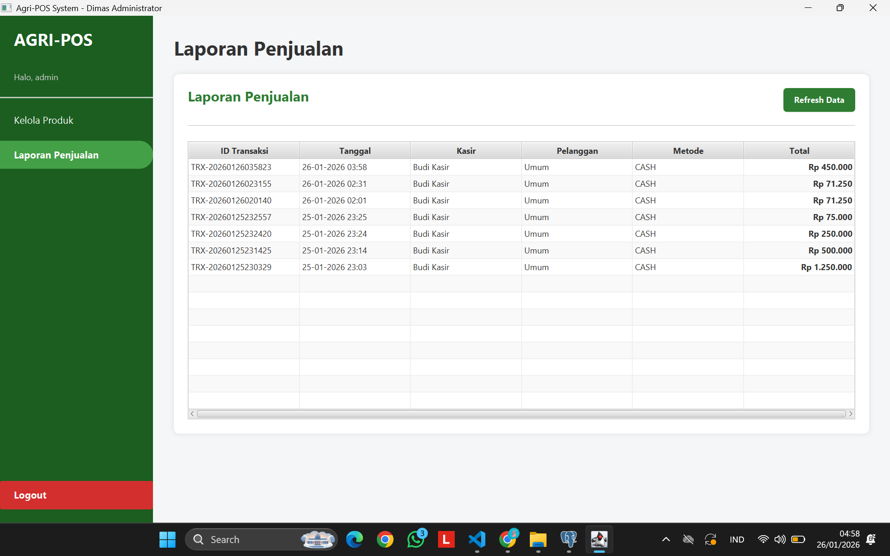

### G. Hasil Integration Testing (JUnit)
Sebagai bukti validitas logika bisnis (Business Logic), berikut adalah hasil eksekusi **JUnit Test** (`AgriPosIntegrationTest.java`).

**12. Build Success (All Tests Passed)**
Gambar ini menunjukkan bahwa seluruh skenario pengujian berhasil dilewati:
1.  **Koneksi Database:** Terhubung stabil (Singleton).
2.  **Transaksi:** Stok berkurang otomatis di DB.
3.  **Retur:** Stok bertambah kembali otomatis di DB.
4.  **History:** Data transaksi valid tersimpan.
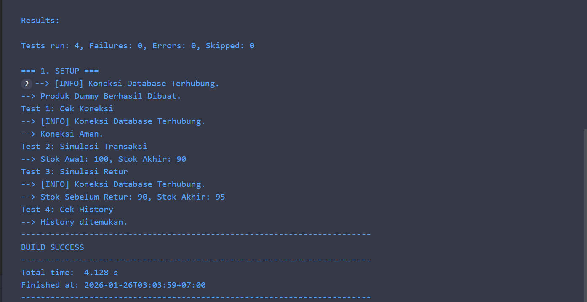

---

## 6. Kendala & Solusi

Selama pengerjaan integrasi ini, terdapat beberapa kendala teknis yang dihadapi:

1.  **Kendala: Koneksi Database Terputus (*"This connection has been closed"*)**
    * **Deskripsi:** Saat melakukan transaksi lalu mencoba memuat ulang produk, muncul error bahwa koneksi tertutup. Ini terjadi karena penggunaan `try-with-resources` pada objek `Connection` di dalam DAO yang secara otomatis menutup koneksi setelah query selesai.
    * **Solusi:** Memperbaiki kode di `ProductDAOImpl`, `TransactionDAOImpl`, dan `VoucherDAO` dengan mengeluarkan objek `Connection` dari blok `try(...)` agar koneksi (Singleton) tetap hidup selama aplikasi berjalan.

2.  **Kendala: Error Override pada TransactionDAO**
    * **Deskripsi:** Saat menambahkan fitur Retur, method `getTransactionItems` ditambahkan di `TransactionDAOImpl` tetapi lupa didaftarkan di interface `TransactionDAO`, menyebabkan error kompilasi karena tidak memenuhi kontrak interface.
    * **Solusi:** Menambahkan deklarasi method `List<CartItem> getTransactionItems(String trxId);` ke dalam interface `TransactionDAO` agar sesuai dengan prinsip OOP dan Polymorphism.

3.  **Kendala: JUnit Test Gagal (Kolom Tidak Ditemukan)**
    * **Deskripsi:** Saat menjalankan Integration Test, muncul error `column "category" does not exist`. Ternyata query SQL di file test tidak sinkron dengan struktur tabel database PostgreSQL yang sebenarnya (tabel `products` tidak memiliki kolom kategori).
    * **Solusi:** Menyesuaikan query `INSERT` di dalam method `@BeforeAll setup()` pada file test agar kolom yang diisi hanya mencakup `code`, `name`, `price`, dan `stock`, sesuai dengan tabel database yang ada.
---