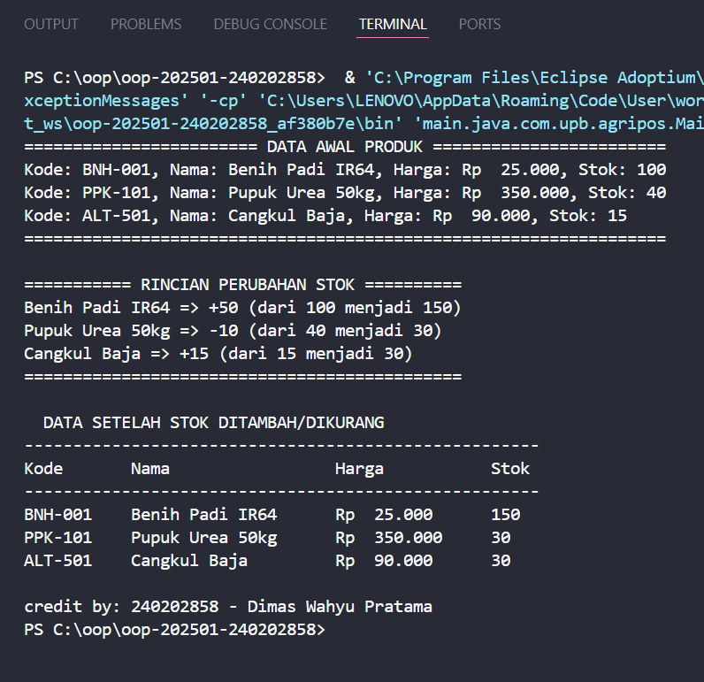

# Laporan Praktikum Minggu 2
Topik: Class, Object, Atribut, Method, dan Enkapsulasi

## Identitas
- Nama  : Dimas Wahyu Pratama
- NIM   : 240202858
- Kelas : 3IKRA

---

## Tujuan
- Mahasiswa memahami konsep dasar pemrograman berorientasi objek (OOP), khususnya class, object, atribut, method, dan enkapsulasi.  
- Mahasiswa mampu menggunakan access modifier dengan benar untuk membatasi akses data.  
- Mahasiswa dapat membangun class `Produk` sebagai representasi objek nyata dalam sistem POS (Point of Sale) pertanian.  
- Mahasiswa mampu memanggil method tambahan (tambahStok dan kurangiStok) serta menampilkan data produk yang telah dimodifikasi.
---

## Dasar Teori
1. **Class** adalah rancangan dasar (blueprint) yang mendefinisikan struktur dan perilaku suatu objek.  
2. **Object** merupakan instansiasi nyata dari class yang memiliki data (atribut) dan perilaku (method).
3. **Access Modifier** (`public`, `private`, `protected`) mengatur tingkat akses terhadap atribut dan method dalam sebuah class.  
4. **Enkapsulasi** adalah prinsip penyembunyian data agar hanya dapat diakses melalui method khusus (getter dan setter).  
5. **Method** dalam OOP digunakan untuk mendefinisikan perilaku objek, contohnya `tambahStok()`, `kurangiStok()`, atau `ubahStok()`.  
---

## Langkah Praktikum
1. Membuat struktur project dengan package:
```
oop-20251-<nim>/
 └─ praktikum/week2-class-object/
     ├─ src/main/java/com/upb/agripos/model/
     │   └─ Produk.java
     ├─ src/main/java/com/upb/agripos/util/
     │   └─ CreditBy.java
     ├─ src/main/java/com/upb/agripos/
     │   └─ MainProduk.java
     ├─ screenshots/
     │   └─ hasil.png
     └─ laporan_week2.md
```
2. Membuat class `Produk` dengan atribut `kode`, `nama`, `harga`, dan `stok` (bersifat `private`).  
3. Menambahkan constructor, `getter`/`setter`, dan method tambahan:  
- `tambahStok(int jumlah)`  
- `kurangiStok(int jumlah)`  
- `ubahStok(int jumlah)` → menampilkan perubahan stok (bertambah atau berkurang).  
4. Menambahkan `formatHarga()` agar harga ditampilkan dengan format mata uang rupiah (`Rp 25.000`).  
5. Menambahkan `tampilkanInfo()` agar data produk dapat ditampilkan dengan ringkas dan konsisten.  
6. Menulis class `MainProduk` untuk menginstansiasi tiga objek `Produk`, lalu menampilkan data awal, perubahan stok, dan hasil akhir dalam bentuk tabel menggunakan `printf()`.  
7. Menambahkan class `CreditBy` untuk menampilkan identitas mahasiswa di akhir program.  
8. Menjalankan program dan memastikan output sesuai harapan.  
---

## Kode Program

```java
//Produk.java
package main.java.com.upb.agripos.model;

public class Produk {
 private String kode;
 private String nama;
 private double harga;
 private int stok;

 public Produk(String kode, String nama, double harga, int stok) {
     this.kode = kode;
     this.nama = nama;
     this.harga = harga;
     this.stok = stok;
 }

 public String getKode() { return kode; }
 public void setKode(String kode) { this.kode = kode; }

 public String getNama() { return nama; }
 public void setNama(String nama) { this.nama = nama; }

 public double getHarga() { return harga; }
 public void setHarga(double harga) { this.harga = harga; }

 public int getStok() { return stok; }
 public void setStok(int stok) { this.stok = stok; }

 public void tambahStok(int jumlah) {
     this.stok += jumlah;
 }

 public boolean kurangiStok(int jumlah) {
     if (jumlah <= 0) return false;
     if (this.stok >= jumlah) {
         this.stok -= jumlah;
         return true;
     } else {
         System.out.println("Stok tidak mencukupi!");
         return false;
     }
 }

 public void ubahStok(int jumlah) {
     int stokAwal = this.stok;
     if (jumlah > 0) {
         tambahStok(jumlah);
         System.out.println(nama + " => +" + jumlah + " (dari " + stokAwal + " menjadi " + stok + ")");
     } else {
         if (kurangiStok(-jumlah)) {
             System.out.println(nama + " => " + jumlah + " (dari " + stokAwal + " menjadi " + stok + ")");
         }
     }
 }

 public String formatHarga() {
     return String.format("Rp %, .0f", this.harga).replace(',', '.');
 }

 public void tampilkanInfo() {
     System.out.println("Kode: " + kode + ", Nama: " + nama + ", Harga: " + formatHarga() + ", Stok: " + stok);
 }
}
```

```java
// MainProduk.java
package main.java.com.upb.agripos;

import main.java.com.upb.agripos.model.*;
import main.java.com.upb.agripos.util.*;

public class MainProduk {
    public static void main(String[] args) {

        Produk p1 = new Produk("BNH-001", "Benih Padi IR64", 25000, 100);
        Produk p2 = new Produk("PPK-101", "Pupuk Urea 50kg", 350000, 40);
        Produk p3 = new Produk("ALT-501", "Cangkul Baja", 90000, 15);

        System.out.println("======================== DATA AWAL PRODUK ========================");
        p1.tampilkanInfo();
        p2.tampilkanInfo();
        p3.tampilkanInfo();
        System.out.println("==================================================================");

        System.out.println("\n=========== RINCIAN PERUBAHAN STOK ==========");
        p1.ubahStok(50);
        p2.ubahStok(-10);
        p3.ubahStok(15);
        System.out.println("=============================================");

        System.out.println("\n  DATA SETELAH STOK DITAMBAH/DIKURANG  ");
        System.out.println("-----------------------------------------------------");
        System.out.printf("%-10s %-20s %-15s %-10s%n", "Kode", "Nama", "Harga", "Stok");
        System.out.println("-----------------------------------------------------");
        System.out.printf("%-10s %-20s %-15s %-10d%n", p1.getKode(), p1.getNama(), p1.formatHarga(), p1.getStok());
        System.out.printf("%-10s %-20s %-15s %-10d%n", p2.getKode(), p2.getNama(), p2.formatHarga(), p2.getStok());
        System.out.printf("%-10s %-20s %-15s %-10d%n", p3.getKode(), p3.getNama(), p3.formatHarga(), p3.getStok());

        CreditBy.print("240202858", "Dimas Wahyu Pratama");
    }
}

```
```java
// CreditBy.java
package main.java.com.upb.agripos.util;

public class CreditBy {
    public static void print(String nim, String nama) {
        System.out.println("\ncredit by: " + nim + " - " + nama);
    }
}
```

---

## Hasil Eksekusi


---

## Analisis
- Program ini memisahkan tanggung jawab setiap class secara jelas:
`Produk` berperan sebagai data model, `MainProduk` sebagai controller, dan `CreditBy` sebagai informasi identitas.
- Atribut pada class `Produk` menggunakan enkapsulasi (private) untuk menjaga integritas data.
- Method `ubahStok()` menunjukkan bagaimana objek bisa berperilaku secara dinamis, dengan menampilkan perubahan stok dari nilai awal ke akhir.
- Penggunaan `printf()` menjadikan tampilan tabel lebih rapi, efisien, dan profesional. 
- Pemformatan harga menggunakan `formatHarga()` menyesuaikan format lokal Indonesia dengan mengganti koma menjadi titik.
- Kendala awal berupa error struktur folder dapat diselesaikan dengan menyesuaikan struktur package main.java.com.upb.agripos.
---

## Kesimpulan

Konsep OOP seperti class, object, dan enkapsulasi membuat kode program lebih aman, modular, dan mudah dikembangkan.
Setiap bagian memiliki tanggung jawab yang spesifik sehingga program menjadi terstruktur.
Fitur tambahan seperti ubahStok() dan tampilan tabel menggunakan printf() meningkatkan keterbacaan sekaligus profesionalitas hasil akhir.
Secara keseluruhan, praktikum ini berhasil menunjukkan implementasi prinsip OOP dasar secara utuh dan efisien.


## Quiz
1. Mengapa atribut sebaiknya dideklarasikan sebagai private dalam class?
Jawaban: Karena dengan private, atribut hanya bisa diakses dari dalam class itu sendiri. Hal ini mencegah manipulasi data dari luar class dan menjaga agar nilai atribut tetap konsisten serta aman dari perubahan yang tidak diinginkan.
2. Apa fungsi getter dan setter dalam enkapsulasi?
Jawaban: Getter dan setter menjadi jembatan antara atribut dan pengguna class. Getter digunakan untuk mengambil nilai, sedangkan setter berfungsi mengatur atau memvalidasi perubahan data agar sesuai aturan yang sudah ditetapkan dalam class.
3. Bagaimana class Produk mendukung pengembangan aplikasi POS yang lebih kompleks?
Jawaban: Class Produk berfungsi sebagai model dasar data barang. Dengan struktur dan method yang sudah ada, class ini dapat dikembangkan menjadi sistem POS(point of sale) yang lebih lengkap, misalnya menambah fitur kategori, stok minimum, laporan penjualan, hingga integrasi transaksi tanpa perlu mengubah pondasi kode yang sudah ada.