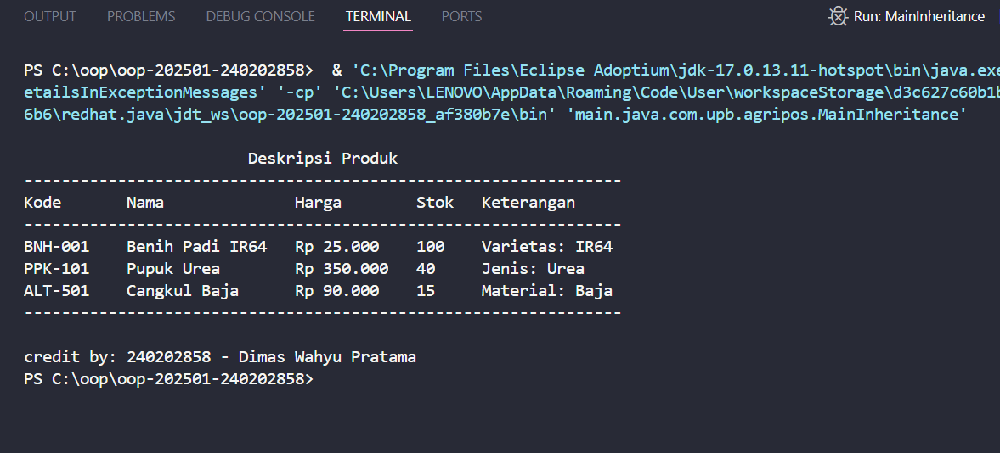

# Laporan Praktikum Minggu 3
Topik: Inheritance

## Identitas
- Nama  : Dimas Wahyu Pratama
- NIM   : 240202858
- Kelas : 3IKRA

---

## Tujuan
Mahasiswa mampu memahami dan menerapkan konsep **inheritance (pewarisan)** dalam pemrograman Java, yaitu bagaimana suatu kelas dapat menurunkan atribut dan method kepada kelas lain yang berhubungan.  
Selain itu, mahasiswa juga mampu mengenali peran **overriding** sebagai bagian dari penerapan inheritance untuk menyesuaikan perilaku method pada subclass sesuai kebutuhan program.

---

## Dasar Teori
1. **Inheritance (pewarisan)** merupakan konsep utama dalam pemrograman berorientasi objek yang memungkinkan sebuah kelas (superclass) menurunkan atribut dan method-nya kepada kelas lain (subclass). Dengan demikian, subclass dapat memanfaatkan kembali kode yang sudah ada tanpa perlu menulis ulang.  
2. Konsep ini digunakan untuk membentuk **hierarki kelas** yang logis dan mempermudah pengelolaan hubungan antar objek dalam program.  
3. **Overriding** merupakan salah satu bentuk penerapan inheritance, di mana subclass dapat menulis ulang method milik superclass agar memiliki perilaku yang lebih spesifik.  
4. Melalui inheritance, kode menjadi lebih **efisien, terstruktur, dan mudah dikembangkan**, karena perubahan di superclass akan otomatis berdampak pada subclass yang mewarisinya.  
5. Inheritance juga mendorong penerapan prinsip **reusability** dan **maintainability**, dua hal penting dalam desain perangkat lunak yang baik.
---

## Langkah Praktikum
1. Membuat package project `main.java.com.upb.agripos.model` untuk menampung kelas model (`Produk`, `Benih`, `Pupuk`, `AlatPertanian`).  
2. Membuat superclass `Produk` yang berisi atribut umum: `kode`, `nama`, `harga`, dan `stok`.  
3. Membuat subclass `Benih`, `Pupuk`, dan `AlatPertanian` yang masing-masing menambahkan atribut khusus (`varietas`, `jenis`, `material`) dan meng-override metode `getKeterangan()`.  
4. Membuat kelas `MainInheritance` untuk menampilkan daftar produk dalam format tabel.  
5. Menggunakan `System.out.printf()` untuk menampilkan data dengan format kolom yang rapi.  
6. Melakukan pengujian dan penyesuaian tampilan output hingga menyerupai format laporan produk yang profesional.  
---

## Kode Program
```java
// Produk.java (super class)
package main.java.com.upb.agripos.model;

public class Produk {
    private String kode;
    private String nama;
    private double harga;
    private int stok;

    public Produk(String kode, String nama, double harga, int stok) {
        this.kode = kode;
        this.nama = nama;
        this.harga = harga;
        this.stok = stok;
    }

    public String getKode() { return kode; }
    public String getNama() { return nama; }
    public double getHarga() { return harga; }
    public int getStok() { return stok; }

    public String getKeterangan() {
        return "";
    }

    public String formatHarga() {
        return String.format("Rp %,.0f", this.harga).replace(',', '.');
    }

    public void deskripsi() {
        System.out.printf("%-10s %-17s %-12s %-6s %s %n",
            getKode(), getNama(), formatHarga(), getStok(), getKeterangan());
    }
}
```
```java
// AlatPertanian.java (sub class)
package main.java.com.upb.agripos.model;

public class AlatPertanian extends Produk {
    private String material;

    public AlatPertanian(String kode, String nama, double harga, int stok, String material) {
        super(kode, nama, harga, stok);
        this.material = material;
    }

    public String getMaterial() { return material; }
    public void setMaterial(String material) { this.material = material; }

    @Override
    public String getKeterangan() {
        return "Material: " + material;
    }

    @Override
    public void deskripsi() {
        super.deskripsi();
        }
}
```
```java
// Benih.java (sub class)
package main.java.com.upb.agripos.model;

public class Benih extends Produk {
    private String varietas;

    public Benih(String kode, String nama, double harga, int stok, String varietas) {
        super(kode, nama, harga, stok);
        this.varietas = varietas;
    }

    public String getVarietas() { return varietas; }
    public void setVarietas(String varietas) { this.varietas = varietas; }

    @Override
    public String getKeterangan() {
        return "Varietas: " + varietas;
    }
    
    @Override
    public void deskripsi() {
        super.deskripsi(); 
    }
}
```
```java
// Pupuk.java (sub class)
package main.java.com.upb.agripos.model;

public class Pupuk extends Produk {
    private String jenis;

    public Pupuk(String kode, String nama, double harga, int stok, String jenis) {
        super(kode, nama, harga, stok);
        this.jenis = jenis;
    }

    @Override
    public String getKeterangan() {
        return "Jenis: " + jenis;
    }

    @Override
    public void deskripsi() {
        super.deskripsi();
    }
}
```
```java
// MainInheritance.java (main Method)
package main.java.com.upb.agripos;

import main.java.com.upb.agripos.model.*;
import main.java.com.upb.agripos.util.CreditBy;

public class MainInheritance {
    public static void main(String[] args) {
        Benih b = new Benih("BNH-001", "Benih Padi IR64", 25000, 100, "IR64");
        Pupuk p = new Pupuk("PPK-101", "Pupuk Urea", 350000, 40, "Urea");
        AlatPertanian a = new AlatPertanian("ALT-501", "Cangkul Baja", 90000, 15, "Baja");

        System.out.println("\n                        Deskripsi Produk                      ");
        System.out.println("----------------------------------------------------------------");
        System.out.printf("%-10s %-17s %-12s %-6s %s %n" ,"Kode", "Nama", "Harga", "Stok", "Keterangan");
        System.out.println("----------------------------------------------------------------");
        b.deskripsi();
        p.deskripsi();
        a.deskripsi();
        System.out.println("----------------------------------------------------------------");

        CreditBy.print("240202858", "Dimas Wahyu Pratama");
    }
}
```
```java
// CreditBy.java
package main.java.com.upb.agripos.util;

public class CreditBy {
    public static void print(String nim, String nama) {
        System.out.println("\ncredit by: " + nim + " - " + nama);
    }
}
```
---

## Hasil Eksekusi 

---

## Analisis
- Program menggunakan konsep **inheritance** di mana `Benih`, `Pupuk`, dan `AlatPertanian` mewarisi atribut dan method dari `Produk`.  
- Setiap subclass **meng-override** method `getKeterangan()` agar menampilkan detail spesifik masing-masing produk sesuai jenisnya.  
- Method `deskripsi()` di dalam `Produk` berfungsi sebagai template umum untuk mencetak data produk dalam format tabel, sementara `getKeterangan()` memberikan fleksibilitas bagi setiap subclass untuk menampilkan informasi tambahan yang berbeda.  
- Pendekatan ini menunjukkan penerapan **polymorphism** secara langsung, karena pemanggilan `deskripsi()` pada berbagai objek `Produk` akan menyesuaikan perilakunya dengan jenis objek yang dipanggil.  
- Dengan desain berbasis inheritance seperti ini, program menjadi lebih **mudah dikembangkan dan dikelola**. Jika di masa depan ditambahkan jenis produk baru, cukup membuat subclass baru tanpa perlu mengubah struktur kode yang sudah ada.
---

## Kesimpulan
Dengan menerapkan konsep **inheritance** dan **polymorphism**, program menjadi lebih terstruktur, efisien, dan mudah diperluas.  
Setiap jenis produk cukup dibuat sebagai subclass baru tanpa perlu mengubah kode utama, dan format tampilan data menjadi seragam serta mudah dibaca.

---

## Quiz 
1. Apa keuntungan menggunakan inheritance dibanding membuat class terpisah tanpa hubungan?  
   **Jawaban:** Dengan inheritance, kode menjadi lebih efisien karena atribut dan method umum cukup ditulis sekali di superclass. Hal ini mengurangi duplikasi kode, memudahkan pemeliharaan, serta membuat hubungan antar class lebih jelas secara hierarkis.  

2. Bagaimana cara subclass memanggil konstruktor superclass?  
   **Jawaban:** Subclass dapat memanggil konstruktor superclass menggunakan keyword `super(...)` di baris pertama konstruktor subclass, dengan menyertakan argumen yang sesuai dengan konstruktor superclass.  

3. Berikan contoh kasus di POS pertanian selain Benih, Pupuk, dan Alat Pertanian yang bisa dijadikan subclass.  
   **Jawaban:** Contoh lainnya adalah `Pestisida` yang memiliki atribut tambahan seperti `bahanAktif`, atau `BibitTernak` dengan atribut `spesies` dan `umur`. Keduanya bisa menjadi subclass dari `Produk` dengan menyesuaikan method `getKeterangan()`.
