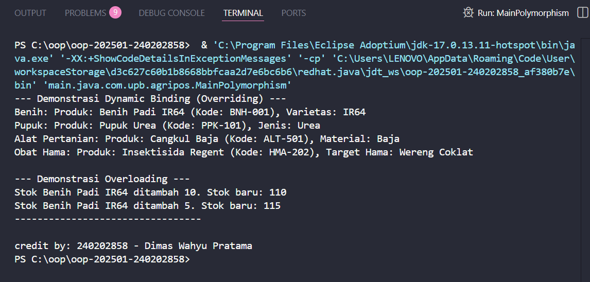

# Laporan Praktikum Minggu 4
Topik: Polymorphism (Overloading, Overriding, Dynamic Binding)

## Identitas
- Nama  : Dimas Wahyu Pratama
- NIM   : 240202858
- Kelas : 3IKRA

---

## Tujuan
* Mahasiswa mampu **menjelaskan konsep polymorphism** dalam OOP.
* Mahasiswa mampu **membedakan method overloading dan overriding**.
* Mahasiswa mampu **mengimplementasikan polymorphism (overriding, overloading, dynamic binding)** dalam program Agri-POS.
* Mahasiswa mampu **menganalisis contoh kasus polymorphism** pada sistem nyata (Agri-POS).
---

## Dasar Teori
1. **Polymorphism** memungkinkan satu interface digunakan oleh banyak bentuk objek berbeda.  
2. **Overloading** terjadi ketika beberapa method memiliki nama yang sama tetapi parameter berbeda.  
3. **Overriding** adalah mekanisme ketika subclass menimpa method dari superclass.  
4. **Dynamic Binding** membuat pemanggilan method diputuskan saat runtime berdasarkan objek aktual.  
5. Polymorphism meningkatkan fleksibilitas dan kemampuan perluasan sistem.
---

## Langkah Praktikum
1. Membuat class `Produk` dan menambahkan dua method `tambahStok` (overloading).  
2. Mengimplementasikan `getInfo()` di `Produk`, kemudian meng-override-nya di subclass: `Benih`, `Pupuk`, dan `AlatPertanian`.  
3. Membuat `MainPolymorphism` untuk mendemonstrasikan dynamic binding melalui array `Produk[]`.  
4. Menjalankan program untuk melihat perbedaan output tiap objek.  
5. Melampirkan screenshot hasil eksekusi.  
6. Commit menggunakan pesan: **`week4-polymorphism`**.
---

## Kode Program
```java
// Produk.java
package main.java.com.upb.agripos.model;

public class Produk {
    private String kode;
    private String nama;
    private double harga;
    private int stok;

    public Produk(String kode, String nama, double harga, int stok) {
        this.kode = kode;
        this.nama = nama;
        this.harga = harga;
        this.stok = stok;
    }

    // Overloading: Menerima parameter integer
    public void tambahStok(int jumlah) {
        this.stok += jumlah;
        System.out.println("Stok " + this.nama + " ditambah " + jumlah + ". Stok baru: " + this.stok);
    }

    // Overloading: Menerima parameter double
    public void tambahStok(double jumlah) {
        // Dikonversi ke int jika perlu
        this.stok += (int) jumlah;
        System.out.println("Stok " + this.nama + " ditambah " + (int)jumlah + ". Stok baru: " + this.stok);
    }

    // Method ini akan dioverride oleh subclass
    public String getInfo() {
        return "Produk: " + nama + " (Kode: " + kode + ")";
    }

}
```
```java
// AlatPertanian.java
package main.java.com.upb.agripos.model;

public class AlatPertanian extends Produk {
    private String material;

    public AlatPertanian(String kode, String nama, double harga, int stok, String material) {
        super(kode, nama, harga, stok);
        this.material = material;
    }

    // Method Overriding
    @Override
    public String getInfo() {
        return "Alat Pertanian: " + super.getInfo() + ", Material: " + material;
    }
}
```
```java
// Benih.java
package main.java.com.upb.agripos.model;

public class Benih extends Produk {
    private String varietas;

    public Benih(String kode, String nama, double harga, int stok, String varietas) {
        super(kode, nama, harga, stok); // Memanggil constructor superclass
        this.varietas = varietas;
    }

    // Method Overriding
    @Override
    public String getInfo() {
        // Memanggil getInfo() dari superclass dan menambahkan info spesifik
        return "Benih: " + super.getInfo() + ", Varietas: " + varietas;
    }
}
```
```java
// ObatHama.java
package main.java.com.upb.agripos.model;

public class ObatHama extends Produk {
    private String targetHama;

    public ObatHama(String kode, String nama, double harga, int stok, String targetHama) {
        // Memanggil constructor superclass (Produk)
        super(kode, nama, harga, stok);
        this.targetHama = targetHama;
    }

    // Method Overriding
    @Override
    public String getInfo() {
        // Memanggil getInfo() dari superclass dan menambahkan info spesifik
        return "Obat Hama: " + super.getInfo() + ", Target Hama: " + targetHama;
    }
}
```
```java
// Pupuk.java
package main.java.com.upb.agripos.model;

public class Pupuk extends Produk {
    private String jenis; 

    public Pupuk(String kode, String nama, double harga, int stok, String jenis) {
        super(kode, nama, harga, stok);
        this.jenis = jenis;
    }

    // Method Overriding
    @Override
    public String getInfo() {
        return "Pupuk: " + super.getInfo() + ", Jenis: " + jenis;
    }
}
```
```java
// MainPolymorphism.java
package main.java.com.upb.agripos;

import main.java.com.upb.agripos.model.*;
import main.java.com.upb.agripos.util.CreditBy;

public class MainPolymorphism {
    public static void main(String[] args) {
        
        System.out.println("--- Demonstrasi Dynamic Binding (Overriding) ---");
        
        Produk[] Produk = {
            new Benih("BNH-001", "Benih Padi IR64", 25000, 100, "IR64"),
            new Pupuk("PPK-101", "Pupuk Urea", 350000, 40, "Urea"),
            new AlatPertanian("ALT-501", "Cangkul Baja", 90000, 15, "Baja"),
            new ObatHama("HMA-202", "Insektisida Regent", 75000, 50, "Wereng Coklat")
        };

        for (Produk p : daftarProduk) {
            System.out.println(p.getInfo()); // Dynamic binding 
        }
        
        System.out.println("\n--- Demonstrasi Overloading ---");
        Produk produkPadi = daftarProduk[0];
        produkPadi.tambahStok(10);
        produkPadi.tambahStok(5.5);
        System.out.println("---------------------------------");

        CreditBy.print("240202858", "Dimas Wahyu Pratama"); 
    }
}
```
---

## Hasil Eksekusi

---

## Analisis
-   **Cara Kode Berjalan:** Program utama (`MainPolymorphism.java`) membuat sebuah array `daftarProduk[]`. Array ini, meskipun dideklarasikan sebagai array `Produk`, dapat menampung objek dari semua *subclass*-nya (seperti `Benih`, `Pupuk`, dll). Saat *looping* `for (Produk p : daftarProduk)` dijalankan, method `p.getInfo()` dipanggil. Di sinilah **Dynamic Binding** terjadi: Java secara otomatis (saat runtime) memeriksa tipe objek *sebenarnya* (misalnya `Benih`) dan menjalankan method `getInfo()` yang telah di-*override* di kelas `Benih`, bukan `getInfo()` dari kelas `Produk`.
-   **Perbedaan dari Minggu Sebelumnya:** Jika minggu-minggu sebelumnya berfokus pada *Inheritance* (pewarisan) di mana subclass "mewarisi" properti dan method, minggu ini kita fokus pada bagaimana subclass dapat "mengubah" perilaku method yang diwarisi tersebut (Overriding). Kita juga belajar memperlakukan semua objek turunan itu secara seragam melalui tipe superclass-nya, yang membuat kode lebih fleksibel.
---

## Kesimpulan
`Polymorphism` membuat program lebih fleksibel dan mudah diperluas. `Overloading`, `overriding`, dan `dynamic binding` bekerja bersama untuk memberikan kemampuan satu method memiliki banyak perilaku sesuai tipe objek.

---

## Quiz
**1. Apa perbedaan overloading dan overriding?**
   **Jawaban:** Perbedaan utamanya adalah:
   * **Overloading:** Terjadi saat *compile-time*. Terjadi di dalam *satu kelas* yang sama. Method memiliki **nama yang sama** tetapi **parameter yang berbeda** (berbeda jumlah atau tipe datanya). Tujuannya untuk fleksibilitas parameter.
   * **Overriding:** Terjadi saat *runtime*. Terjadi antara *superclass dan subclass*. Subclass menyediakan implementasi baru untuk method yang **sudah ada di superclass** dengan **nama dan parameter yang sama persis**. Tujuannya untuk penyesuaian perilaku superclass.

**2. Bagaimana Java menentukan method mana yang dipanggil dalam dynamic binding?**
   **Jawaban:** Java menentukannya pada **saat program berjalan (runtime)**. Java melihat **tipe objek yang sebenarnya** (misalnya, `Benih` atau `Pupuk`), bukan tipe variabel referensinya (misalnya, `Produk`). Saat `p.getInfo()` dipanggil, Java memeriksa objek `p` sebenarnya, lalu mencari implementasi `getInfo()` di kelas objek tersebut.

**3. Berikan contoh kasus polymorphism dalam sistem POS selain produk pertanian.**
   **Jawaban:** Contohnya adalah pada sistem **metode pembayaran (Payment)**.
   * Anda bisa memiliki *superclass* `MetodePembayaran` dengan method `prosesBayar(double jumlah)`.
   * *Subclass*-nya bisa berupa `KartuKredit`, `TransferBank`, dan `EWallet` (seperti OVO/Gopay).
   * Setiap *subclass* akan meng-*override* method `prosesBayar()`:
        * `KartuKredit.prosesBayar()` akan memvalidasi nomor kartu dan CVV.
        * `TransferBank.prosesBayar()` akan men-generate nomor *virtual account*.
        * `EWallet.prosesBayar()` akan meminta scan QR code atau nomor telepon.
   * Saat checkout, kasir hanya memanggil `metodePilihan.prosesBayar(totalBelanja)`, dan polymorphism akan menjalankan proses yang benar sesuai metode yang dipilih pelanggan.
