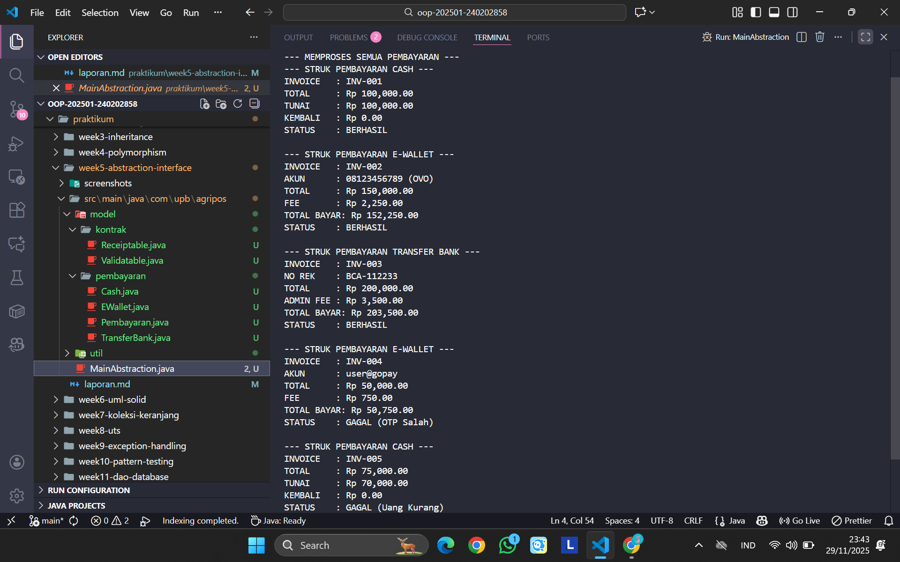

# Laporan Praktikum Minggu 1 (sesuaikan minggu ke berapa?)
Topik: [Tuliskan judul topik, misalnya "Class dan Object"]

## Identitas
- Nama  : Dimas Wahyu Pratama
- NIM   : 240202858
- Kelas : 3IKRA

---

## Tujuan
Tujuan dari praktikum minggu ini adalah agar mahasiswa dapat:

1. Memahami perbedaan mendasar antara Abstract Class dan Interface dalam konsep OOP.
2. Mendesain struktur kelas menggunakan Abstract Class untuk menampung logika dasar dan data yang sama.
3. Mengimplementasikan Interface sebagai kontrak *behavior* yang harus dimiliki oleh sebuah kelas.
4. Menerapkan Multiple Inheritance menggunakan interface pada studi kasus sistem pembayaran Agri-POS.
---

## Dasar Teori
**Abstraction** adalah cara menyederhanakan sistem kompleks dengan menyembunyikan detail implementasi.

### 1. Abstract Class  
Kelas yang berfungsi sebagai kerangka dasar (*blueprint*) dan tidak dapat diinstansiasi.  
Dapat memiliki:
- *Abstract method* → wajib diisi subclass  
- *Concrete method* → sudah memiliki isi

Cocok untuk objek yang “sejenis”.

### 2. Interface  
Sekumpulan kontrak perilaku yang hanya berisi nama method tanpa implementasi.  
Digunakan untuk mendefinisikan kemampuan (*can-do*) suatu objek.

### 3. Multiple Inheritance  
Java tidak mengizinkan pewarisan banyak kelas, tetapi mengizinkan implementasi banyak interface.  
Ini menjadi solusi aman terhadap *diamond problem*.

---

## Langkah Praktikum
1. **Persiapan Project**  
   Membuat package `main.java.com.upb.agripos.model.pembayaran` dan `main.java.com.upb.agripos.model.kontrak`.

2. **Membuat Abstract Class**  
   Membuat class `Pembayaran` yang menyimpan data umum (`invoiceNo`, `total`) dan berisi dua method abstrak:  
   - `biaya()`  
   - `prosesPembayaran()`  

3. **Membuat Interface**
   - `Validatable` → Kontrak validasi (misalnya OTP).  
   - `Receiptable` → Kontrak cetak struk.

4. **Implementasi Subclass**
   - **Cash** → extends `Pembayaran`, implements `Receiptable`  
   - **EWallet** → extends `Pembayaran`, implements `Validatable` & `Receiptable`  
   - **TransferBank** (latihan mandiri) → mirip EWallet dengan biaya admin berbeda

5. **Main Class**  
   Membuat `MainAbstraction.java` untuk menjalankan simulasi pembayaran menggunakan array polimorfik.

6. **Commit**  
   Menyimpan seluruh perubahan ke Git dengan pesan commit: `week5-abstraction-interface`.

---

## Kode Program
```java
// Receiptable.java
public interface Receiptable {
    String cetakStruk();
}
```
```java
// Validatable.java
public interface Validatable {
    boolean validasi(); // misal validasi OTP/ PIN
}
```
```java
// Cash.java
package main.java.com.upb.agripos.model.pembayaran;

import main.java.com.upb.agripos.model.kontrak.Receiptable;

public class Cash extends Pembayaran implements Receiptable {
    private double tunai;

    public Cash(String invoiceNo, double total, double tunai) {
        super(invoiceNo, total);
        this.tunai = tunai;
    }

    @Override
    public double biaya() {
        return 0.0;
    }

    @Override
    public boolean prosesPembayaran() {
        return tunai >= totalBayar(); // sederhana: cukup uang tunai
    }

    @Override
    public String cetakStruk() {
        // Menghitung kembalian, pastikan tidak negatif
        double kembali = Math.max(0, tunai - totalBayar());
        
        return String.format("--- STRUK PEMBAYARAN CASH ---\n" +
                             "INVOICE   : %s\n" +
                             "TOTAL     : Rp %,.2f\n" +
                             "TUNAI     : Rp %,.2f\n" +
                             "KEMBALI   : Rp %,.2f\n" +
                             "STATUS    : %s\n",
                             invoiceNo, totalBayar(), tunai, kembali, 
                             prosesPembayaran() ? "BERHASIL" : "GAGAL (Uang Kurang)");
    }
}
```
```java
// Ewallet.java
package main.java.com.upb.agripos.model.pembayaran;

import main.java.com.upb.agripos.model.kontrak.Receiptable;
import main.java.com.upb.agripos.model.kontrak.Validatable;


public class EWallet extends Pembayaran implements Validatable, Receiptable {
    private String akun;
    private String otp; // sederhana untuk simulasi

    public EWallet(String invoiceNo, double total, String akun, String otp) {
        super(invoiceNo, total);
        this.akun = akun;
        this.otp = otp;
    }

    @Override
    public double biaya() {
        return total * 0.015; // 1.5% fee
    }

    @Override
    public boolean validasi() {
        return otp != null && otp.length() == 6; // contoh validasi sederhana
    }

    @Override
    public boolean prosesPembayaran() {
        return validasi(); // jika validasi lolos, anggap berhasil
    }

    @Override
    public String cetakStruk() {
        return String.format("--- STRUK PEMBAYARAN E-WALLET ---\n" +
                             "INVOICE   : %s\n" +
                             "AKUN      : %s\n" +
                             "TOTAL     : Rp %,.2f\n" +
                             "FEE       : Rp %,.2f\n" +
                             "TOTAL BAYAR: Rp %,.2f\n" +
                             "STATUS    : %s\n",
                             invoiceNo, akun, total, biaya(), totalBayar(),
                             prosesPembayaran() ? "BERHASIL" : "GAGAL (OTP Salah)");
    }
}
```
```java
// Pembayaran.java
Ppackage main.java.com.upb.agripos.model.pembayaran;

public abstract class Pembayaran {
    protected String invoiceNo;
    protected double total;

    public Pembayaran(String invoiceNo, double total) {
        this.invoiceNo = invoiceNo;
        this.total = total;
    }

    public abstract double biaya();               // fee/biaya tambahan
    public abstract boolean prosesPembayaran();   // proses spesifik tiap metode

    public double totalBayar() {
        return total + biaya();
    }

    public String getInvoiceNo() { return invoiceNo; }
    public double getTotal() { return total; }
}
```
```java
// TransferBank.java
package main.java.com.upb.agripos.model.pembayaran;

import main.java.com.upb.agripos.model.kontrak.Validatable;
import main.java.com.upb.agripos.model.kontrak.Receiptable;

// Latihan Mandiri: TransferBank
// implements Validatable (untuk cek mutasi) dan Receiptable (untuk struk)
public class TransferBank extends Pembayaran implements Validatable, Receiptable {
    
    private String noRekening;
    private boolean sudahTransfer; // Simulasi pengecekan mutasi

    public TransferBank(String invoiceNo, double total, String noRekening, boolean sudahTransfer) {
        super(invoiceNo, total);
        this.noRekening = noRekening;
        this.sudahTransfer = sudahTransfer;
    }

    @Override
    public double biaya() {
        // Biaya admin tetap
        return 3500.0;
    }

    @Override
    public boolean validasi() {
        // Validasi: Cek apakah sistem sudah mendeteksi transfer masuk
        return sudahTransfer;
    }

    @Override
    public boolean prosesPembayaran() {
        // Proses berhasil jika validasi (cek mutasi) berhasil
        return validasi();
    }

    @Override
    public String cetakStruk() {
        return String.format("--- STRUK PEMBAYARAN TRANSFER BANK ---\n" +
                             "INVOICE   : %s\n" +
                             "NO REK    : %s\n" +
                             "TOTAL     : Rp %,.2f\n" +
                             "ADMIN FEE : Rp %,.2f\n" +
                             "TOTAL BAYAR: Rp %,.2f\n" +
                             "STATUS    : %s\n",
                             invoiceNo, noRekening, total, biaya(), totalBayar(),
                             prosesPembayaran() ? "BERHASIL" : "GAGAL (Transfer Belum Diterima)");
    }
}
```
```java
// MainAbstraction.java
package main.java.com.upb.agripos;

import main.java.com.upb.agripos.model.kontrak.*;
import main.java.com.upb.agripos.model.pembayaran.*; 
import main.java.com.upb.agripos.util.CreditBy;

public class MainAbstraction {
    public static void main(String[] args) {
        
        // Buat array polimorfik bertipe Pembayaran
        Pembayaran[] daftarPembayaran = {
            // Kasus 1: Cash berhasil (tunai > total)
            new Cash("INV-001", 100000, 100000),
            
            // Kasus 2: EWallet berhasil (OTP 6 digit)
            new EWallet("INV-002", 150000, "08123456789 (OVO)", "123456"),
            
            // Kasus 3: Transfer Bank (Latihan Mandiri) berhasil
            new TransferBank("INV-003", 200000, "BCA-112233", true), // true = sudah transfer
            
            // Kasus 4: EWallet gagal (OTP salah)
            new EWallet("INV-004", 50000, "user@gopay", "123"), // OTP hanya 3 digit
            
            // Kasus 5: Cash gagal (uang kurang)
            new Cash("INV-005", 75000, 70000) // Bayar 70rb untuk total 75rb
        };

        System.out.println("--- MEMPROSES SEMUA PEMBAYARAN ---");

        // Loop dan proses
        for (Pembayaran p : daftarPembayaran) {
            // Kita harus melakukan casting ke (Receiptable)
            // karena method cetakStruk() BUKAN bagian dari abstract class Pembayaran,
            // tapi bagian dari interface Receiptable.
            if (p instanceof Receiptable) {
                Receiptable r = (Receiptable) p;
                System.out.println(r.cetakStruk());
            } else {
                System.out.println("Metode pembayaran " + p.getInvoiceNo() + " tidak bisa cetak struk.");
            }
        }

        System.out.println("---------------------------------");
        // GANTI DENGAN NIM DAN NAMA ANDA
        CreditBy.print("240202858", "Dimas Wahyu Pratama");
    }
}
```
---

## Hasil Eksekusi

---

## Analisis

### Alur Program  
- `Pembayaran` menjadi kerangka umum untuk semua jenis pembayaran.  
- `EWallet` memperoleh dua kemampuan tambahan melalui interface: **validasi** dan **cetak struk**.  
- Semua objek pembayaran dimasukkan ke dalam array `Pembayaran[]` dan diproses secara **polimorfik**.

### Perbedaan dari Minggu Lalu  
- Minggu lalu hanya melakukan **override** method dari superclass biasa.  
- Minggu ini menggunakan **abstract class**, sehingga method tertentu *wajib* diimplementasikan subclass.  
- Interface memperkenalkan konsep pemisahan antara **data (class)** dan **kemampuan (interface)**.
---

## Kesimpulan  

Praktikum ini menunjukkan pentingnya desain OOP yang terstruktur.  

- **Abstract Class** digunakan untuk mendefinisikan identitas objek yang sejenis.  
- **Interface** memberikan fleksibilitas untuk menambahkan kemampuan tanpa mengubah hierarki pewarisan.  

Kombinasi keduanya membuat sistem Agri-POS menjadi lebih modular, aman, dan mudah dikembangkan.

---

## Quiz

### 1. Jelaskan perbedaan konsep dan penggunaan abstract class dan interface.  
**Jawaban:**  
- Abstract class → mendefinisikan identitas (*is-a*) dan dapat memiliki data serta logika dasar.  
- Interface → mendefinisikan kemampuan (*can-do*) dan hanya berisi kontrak method tanpa implementasi.

### 2. Mengapa multiple inheritance lebih aman dilakukan dengan interface pada Java?  
**Jawaban:**  
Karena interface tidak memiliki implementasi method sehingga tidak menimbulkan konflik jika ada method dengan nama yang sama.  
Hal ini mencegah terjadinya *diamond problem*.

### 3. Pada contoh Agri-POS, bagian mana yang menjadi abstract class dan mana yang menjadi interface?  
**Jawaban:**  
- **Abstract Class:** `Pembayaran` → menyimpan data umum pembayaran.  
- **Interface:** `Validatable` & `Receiptable` → fitur tambahan yang tidak selalu dibutuhkan semua jenis pembayaran.
