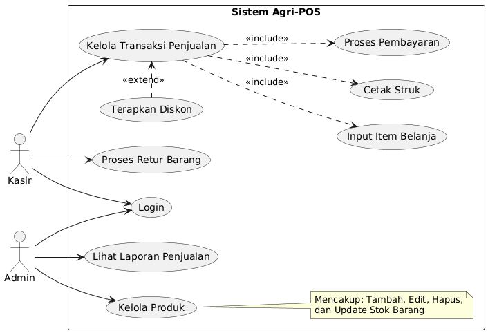
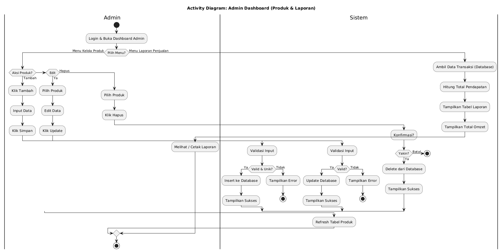
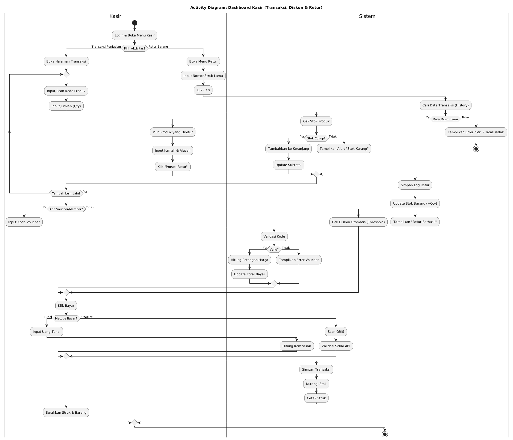
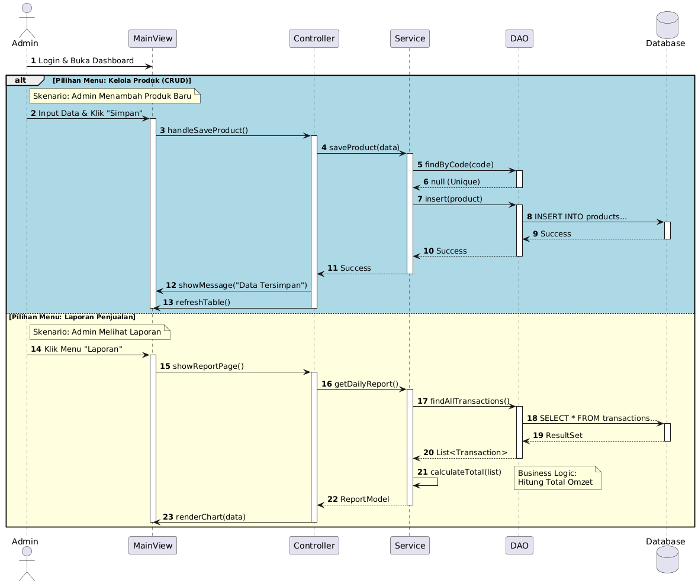
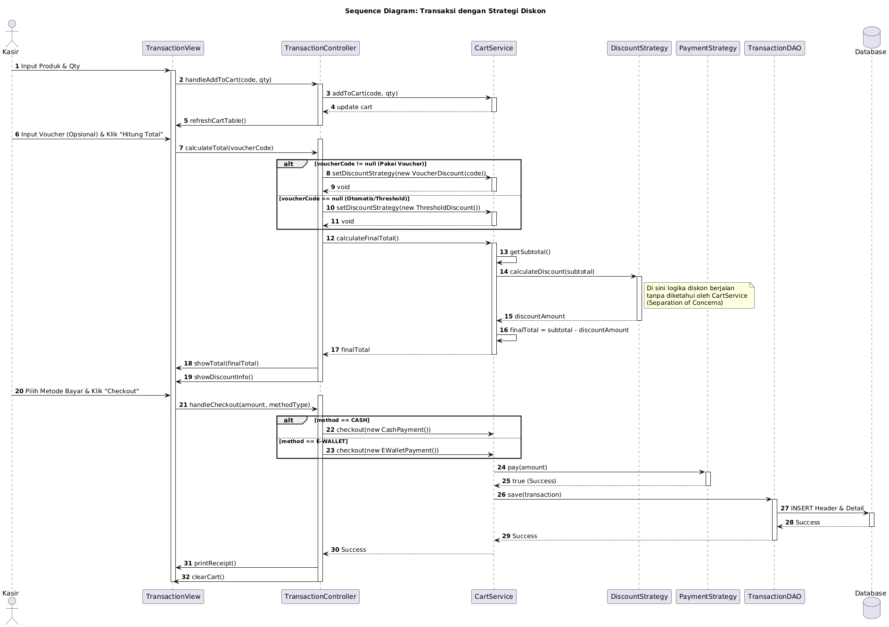
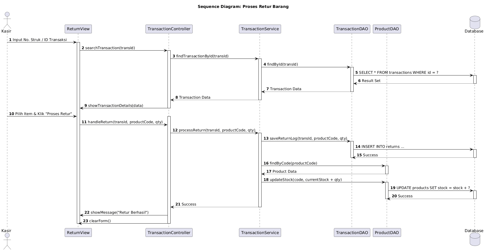
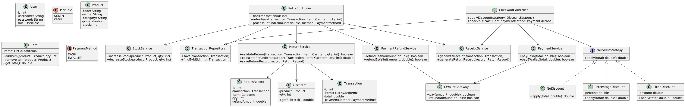

# Laporan Praktikum Week 6: Desain Arsitektur Sistem dengan UML dan Prinsip SOLID

## Identitas
- **Nama** : Dimas Wahyu Pratama
- **NIM** : 240202858
- **Kelas** : 3IKRA

---

## 1. Deskripsi Sistem
**Agri-POS** adalah sistem kasir (*Point of Sales*) yang dirancang khusus untuk memenuhi kebutuhan toko pertanian. Sistem ini bertujuan mendigitalisasi proses bisnis yang sebelumnya manual menjadi terintegrasi.

Sistem ini memiliki dua aktor utama dengan hak akses berbeda:
1.  **Admin**: Bertanggung jawab atas manajemen data master (Inventaris Produk) dan pemantauan kinerja toko melalui Laporan Penjualan.
2.  **Kasir**: Bertanggung jawab atas operasional harian, meliputi transaksi penjualan, penerapan diskon/promosi, dan penanganan retur barang dari pelanggan.

Arsitektur sistem dirancang menggunakan pendekatan **MVC (Model-View-Controller)** dan pola desain **DAO (Data Access Object)** untuk memastikan sistem bersifat modular, mudah diuji (*testable*), dan mudah dikembangkan di masa depan (*future-proof*).

---

## 2. Rancangan Diagram UML

Berikut adalah artefak desain UML yang memodelkan struktur dan perilaku sistem Agri-POS:

### A. Use Case Diagram
Diagram ini memetakan fungsionalitas sistem berdasarkan aktor yang terlibat.

**Penjelasan:**
* **Admin** memiliki akses ke fitur krusial "Kelola Produk" (mencakup tambah, ubah, hapus, dan update stok) serta "Lihat Laporan Penjualan".
* **Kasir** fokus pada "Kelola Transaksi Penjualan" yang mencakup sub-proses (Include) seperti input item, proses pembayaran, dan cetak struk.
* Fitur **"Proses Retur Barang"** dan **"Terapkan Diskon"** ditambahkan untuk mengakomodasi skenario bisnis toko pertanian yang dinamis (grosir/eceran).

---

### B. Activity Diagram
Diagram aktivitas menggambarkan alur kerja (*workflow*) sistem dari sudut pandang operasional.

**1. Dashboard Admin (Kelola Produk & Laporan)**

Diagram ini menggabungkan dua aktivitas utama Admin. Pada alur CRUD Produk, sistem melakukan validasi ketat (misal: cek duplikasi kode produk) sebelum menyimpan data ke database. Jika sukses, sistem otomatis me-refresh tampilan tabel. Pada alur Laporan, sistem mengolah data transaksi mentah menjadi ringkasan omzet.

**2. Dashboard Kasir (Transaksi & Retur)**

Diagram ini menangani logika bisnis yang kompleks:
* **Looping Belanja:** Kasir dapat input item berulang kali ke dalam keranjang (*Cart*).
* **Logika Diskon:** Sistem mengecek apakah pelanggan berhak mendapat diskon (via Voucher atau Threshold belanja).
* **Retur Barang:** Alur khusus untuk mengembalikan stok barang ke inventaris jika terjadi komplain transaksi.

---

### C. Sequence Diagram
Diagram sekuens merinci interaksi antar objek (Class) untuk skenario spesifik, menunjukkan penerapan arsitektur MVC.

**1. Skenario Admin: Dashboard & CRUD**

Diagram ini menunjukkan pemisahan tanggung jawab yang jelas. `View` menangkap input, `Controller` memvalidasi, `Service` menangani logika bisnis (misal: cek unik), dan `DAO` mengeksekusi query SQL. Alur ini menjamin data tidak langsung diakses oleh UI.

**2. Skenario Kasir 1: Transaksi dengan Strategi Diskon**

Diagram ini adalah implementasi teknis dari fitur "belanja cerdas" yang menerapkan **Open/Closed Principle (OCP)**.
* **Logika Diskon:** `CartService` tidak menghitung diskon secara langsung, melainkan mendelegasikan tugas ke `DiscountStrategy`. Hal ini memungkinkan sistem memilih antara `VoucherDiscount` atau `ThresholdDiscount` secara dinamis tanpa mengubah logika inti.
* **Pembayaran:** Saat checkout, sistem memilih strategi bayar (Tunai/E-Wallet) melalui `PaymentStrategy`, menjaga `CartService` tetap bersih dari logika spesifik metode bayar.

**3. Skenario Kasir 2: Proses Retur Barang**

Diagram ini menggambarkan alur penanganan komplain pelanggan.
* **Pencarian Data:** Sistem menggunakan `TransactionService` untuk mencari rekam jejak transaksi lama berdasarkan ID/Struk.
* **Restock Otomatis:** Poin krusial pada diagram ini adalah interaksi antara `TransactionService` dengan `ProductDAO`. Saat retur disetujui, sistem secara otomatis mengembalikan stok barang ke inventaris (`updateStock`), menjamin keakuratan data gudang.

---

### D. Class Diagram
Diagram kelas adalah *blueprint* struktur kode program yang menunjukkan relasi statis antar komponen.

**Penjelasan Struktur:**
* **Package Model:** Berisi entitas data (`Product`, `Transaction`, `Cart`).
* **Package DAO:** Interface dan Class untuk akses database, memisahkan SQL dari logika aplikasi.
* **Package Service:** Pusat logika bisnis (`ProductService`, `CartService`, `TransactionService`).
* **Package Strategy:** Interface untuk algoritma yang bervariasi (`PaymentStrategy`, `DiscountStrategy`).
* **Package Controller & View:** Menangani interaksi pengguna.

---

## 3. Penerapan Prinsip SOLID

Desain Agri-POS menerapkan prinsip SOLID untuk memastikan kode *robust* dan *maintainable*. Berikut adalah 3 prinsip utama yang diterapkan:

### 1. Single Responsibility Principle (SRP)
Setiap kelas memiliki satu tanggung jawab spesifik.
* **Penerapan:** Pemisahan layer **DAO, Service, dan Controller**.
    * `ProductDAO`: Hanya mengurus koneksi dan query SQL.
    * `TransactionService`: Khusus mengurus logika retur dan histori transaksi, terpisah dari `CartService` yang mengurus belanjaan aktif.
* **Manfaat:** Perubahan pada logika database tidak akan merusak logika perhitungan bisnis.

### 2. Open/Closed Principle (OCP)
Kelas terbuka untuk ekstensi, tapi tertutup untuk modifikasi.
* **Penerapan:** Penggunaan **Strategy Pattern** pada fitur Pembayaran dan Diskon.
    * Kita memiliki interface `PaymentStrategy` dan implementasi `CashPayment`, `EWalletPayment`.
    * Kita memiliki interface `DiscountStrategy` dan implementasi `ThresholdDiscount`, `VoucherDiscount`.
* **Manfaat:** Jika di masa depan toko ingin menambah jenis diskon baru (misal: "Diskon Ulang Tahun"), kita cukup membuat class baru tanpa mengubah kode di `CartService`.

### 3. Dependency Inversion Principle (DIP)
Modul tingkat tinggi tidak boleh bergantung pada modul tingkat rendah. Keduanya harus bergantung pada abstraksi.
* **Penerapan:** `ProductService` dan `TransactionService` tidak bergantung pada class konkret (seperti `ProductDAOImpl`), melainkan bergantung pada **interface** (`ProductDAO`).
* **Manfaat:** Memudahkan pengujian (*Unit Testing*) dan penggantian implementasi database di masa depan.

---

## 4. Tabel Traceability

Tabel ini memetakan kebutuhan fungsional (FR) ke dalam elemen desain untuk memastikan seluruh kebutuhan terpenuhi.

| Functional Requirement (FR) | Use Case | Activity / Sequence | Class / Interface Realisasi |
| :--- | :--- | :--- | :--- |
| **Manajemen Produk** | UC-Kelola Produk | Activity Admin / Seq Admin | `ProductController`, `ProductService`, `ProductDAO` |
| **Transaksi Penjualan** | UC-Kelola Transaksi | Activity Kasir / Seq Transaksi Diskon | `TransactionController`, `CartService`, `Cart` |
| **Metode Pembayaran** | UC-Proses Pembayaran | Seq Transaksi Diskon (Checkout) | `PaymentStrategy`, `CashPayment`, `EWalletPayment` |
| **Penerapan Diskon** | UC-Terapkan Diskon | Seq Transaksi Diskon | `DiscountStrategy`, `VoucherDiscount`, `ThresholdDiscount` |
| **Retur Barang** | UC-Proses Retur | Activity Kasir / Seq Retur Barang | `TransactionService`, `TransactionDAO`, `ProductDAO` |
| **Laporan Penjualan** | UC-Lihat Laporan | Activity Admin | `TransactionDAO.findAll()`, `ReportView` |

---

## 5. Kesimpulan dan Refleksi

Perancangan arsitektur Agri-POS ini telah berhasil menerjemahkan kebutuhan bisnis toko pertanian ke dalam desain teknis yang solid. Penggunaan UML membantu memvisualisasikan alur sistem yang kompleks (seperti logika diskon dinamis dan restock otomatis saat retur), sementara penerapan prinsip SOLID menjamin kualitas kode jangka panjang.

**Keunggulan Desain:**
1.  **Modular:** Logika retur dipisah dari logika belanja, mencegah kode menjadi rumit (*spaghetti code*).
2.  **Scalable:** Siap menerima penambahan fitur strategi pembayaran atau promosi baru dengan mudah.
3.  **Ready-to-Code:** Struktur Class Diagram sudah selaras dengan kebutuhan implementasi JavaFX dan Database (JDBC) untuk tahap pengembangan selanjutnya.