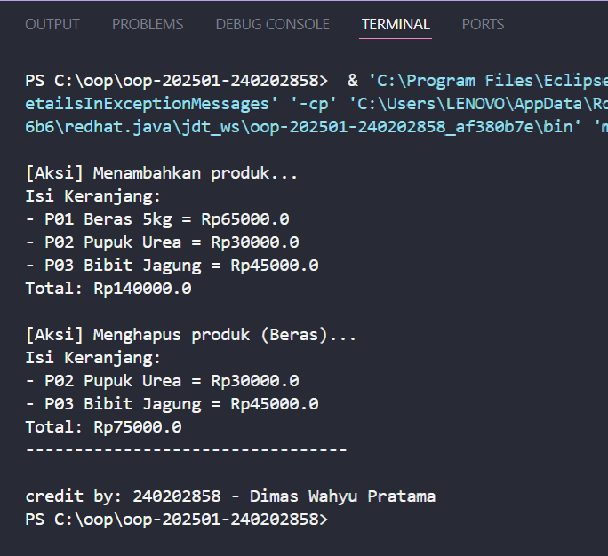

# Laporan Praktikum Minggu 7
Topik: Collections dan Implementasi Keranjang Belanja

## Identitas
- Nama  : Dimas Wahyu Pratama
- NIM   : 240202858
- Kelas : 3IKRA

---

## Tujuan
1.  Mahasiswa mampu menjelaskan konsep collection dalam Java (List, Map, Set).
2.  Mahasiswa mampu menggunakan `ArrayList` untuk menyimpan dan mengelola objek secara dinamis.
3.  Mahasiswa dapat melakukan operasi dasar pada collection seperti menambah, menghapus, dan menghitung total data.
4.  Mahasiswa mampu menganalisis penggunaan struktur data yang tepat untuk kasus Keranjang Belanja Agri-POS.

---

## Dasar Teori
1.  **Java Collections Framework**: Merupakan kumpulan antarmuka (interfaces) dan kelas untuk menyimpan dan memanipulasi sekelompok data sebagai satu unit tunggal.
2.  **List (ArrayList)**: Struktur data yang menyimpan elemen secara berurutan (ordered collection). List mengizinkan adanya elemen duplikat.
3.  **Map (HashMap)**: Struktur data yang menyimpan data dalam pasangan *key* dan *value*. Setiap *key* harus unik, dan digunakan untuk mengakses *value* dengan cepat.
4.  **Set (HashSet)**: Struktur data yang menjamin keunikan elemen (tidak ada duplikat) dan umumnya tidak menjamin urutan penyimpanan data.

---

## Langkah Praktikum
1.  **Persiapan Project**: Membuat package baru `com.upb.agripos` di dalam folder `src/main/java`.
2.  **Pembuatan Model**: Membuat class `Product` dengan atribut kode, nama, dan harga beserta constructor dan getter.
3.  **Implementasi Logic**: Membuat class `ShoppingCart` yang menggunakan `ArrayList<Product>` untuk menampung barang belanjaan.
4.  **Pembuatan Main Program**: Membuat class `MainCart` untuk mensimulasikan proses belanja (tambah produk, cetak struk, hapus produk).
5.  **Eksekusi & Dokumentasi**: Menjalankan program `MainCart`, memastikan output sesuai dengan Nama dan NIM mahasiswa, lalu mengambil screenshot hasil.

---

## Kode Program
```java
// Product.java
package main.java.com.upb.agripos;

public class Product {
    private final String code;
    private final String name;
    private final double price;

    public Product(String code, String name, double price) {
        this.code = code;
        this.name = name;
        this.price = price;
    }

    public String getCode() { return code; }
    public String getName() { return name; }
    public double getPrice() { return price; }
}
```
```java
// ShoppingCart.java
package main.java.com.upb.agripos; 

import java.util.ArrayList;

public class ShoppingCart {
    private final ArrayList<Product> items = new ArrayList<>();

    public void addProduct(Product p) {
        items.add(p);
    }

    public void removeProduct(Product p) {
        items.remove(p);
    }

    public double getTotal() {
        double sum = 0;
        for (Product p : items) {
            sum += p.getPrice();
        }
        return sum;
    }

    public void printCart() {
        System.out.println("Isi Keranjang:");
        for (Product p : items) {
            System.out.println("- " + p.getCode() + " " + p.getName() + " = Rp" + p.getPrice());
        }
        System.out.println("Total: Rp" + getTotal());
    }
}
```
```java
// MainCart.java
package main.java.com.upb.agripos;

import main.java.com.upb.agripos.util.CreditBy;

public class MainCart {
    public static void main(String[] args) {

        // 1. Buat Objek Produk
        Product p1 = new Product("P01", "Beras 5kg", 65000);
        Product p2 = new Product("P02", "Pupuk Urea", 30000);
        Product p3 = new Product("P03", "Bibit Jagung", 45000);

        // 2. Buat Keranjang Belanja
        ShoppingCart cart = new ShoppingCart();

        // 3. Tambah Produk
        System.out.println("\n[Aksi] Menambahkan produk...");
        cart.addProduct(p1);
        cart.addProduct(p2);
        cart.addProduct(p3);
        cart.printCart();

        // 4. Hapus Produk
        System.out.println("\n[Aksi] Menghapus produk (Beras)...");
        cart.removeProduct(p1);
        cart.printCart();

        System.out.println("---------------------------------");
        CreditBy.print("240202858", "Dimas Wahyu Pratama");
    }
}

```
---

## Hasil Eksekusi

---

## Analisis

* **Cara Kerja Kode:**
    Program dimulai dengan membuat objek Product. Objek-objek ini kemudian dimasukkan ke dalam ShoppingCart menggunakan method addProduct(). Di dalam class ShoppingCart, ArrayList digunakan sebagai penampung. Saat getTotal() dipanggil, program melakukan looping (iterasi) pada list untuk menjumlahkan harga.

* **Perbedaan dengan Array Biasa:**
    Pada minggu-minggu sebelumnya, kita mungkin menggunakan Array statis (Product[]) yang ukurannya harus ditentukan di awal. Dengan ArrayList, ukuran penyimpanan bersifat dinamis (bisa bertambah dan berkurang otomatis), sehingga kode menjadi lebih fleksibel dan minim error IndexOutOfBounds.

* **Kendala:**
    Kendala utama adalah memahami bahwa items.remove(p) bekerja berdasarkan referensi objek. Jika kita membuat objek produk baru dengan data yang sama persis tapi referensi memorinya berbeda, remove mungkin tidak bekerja seperti yang diharapkan kecuali kita meng-override method equals(). Namun dalam kasus sederhana ini, kita menghapus menggunakan variabel referensi yang sama (p1), sehingga berjalan lancar.

---

## Kesimpulan

Praktikum minggu ini mengajarkan pentingnya penggunaan Collections Framework dalam pengembangan perangkat lunak. Penggunaan ArrayList sangat memudahkan pengelolaan data yang jumlahnya tidak pasti, seperti keranjang belanja. Kode menjadi lebih bersih (clean code) dan mudah dibaca dibandingkan menggunakan manipulasi array manual. Pemahaman tentang List, Map, dan Set sangat krusial untuk menangani struktur data yang lebih kompleks di masa depan.

---

## Quiz

**1. Jelaskan perbedaan mendasar antara List, Map, dan Set.**
* **List:** Menyimpan elemen secara berurutan (sesuai urutan masuk/indeks) dan mengizinkan adanya data duplikat.
* **Map:** Menyimpan data berpasangan (Key-Value). Key bersifat unik (tidak boleh duplikat) dan digunakan untuk mengakses Value.
* **Set:** Menyimpan elemen unik saja (tidak boleh ada duplikat). Biasanya tidak menjamin urutan penyimpanan.

**2. Mengapa ArrayList cocok digunakan untuk keranjang belanja sederhana?**
ArrayList cocok karena keranjang belanja membutuhkan urutan penambahan barang (siapa yang masuk duluan biasanya ditampilkan duluan di struk) dan sering terjadi operasi penambahan elemen secara dinamis tanpa perlu mendefinisikan kapasitas maksimal di awal.

**3. Bagaimana struktur Set mencegah duplikasi data?**
Set mencegah duplikasi dengan cara memeriksa apakah elemen yang akan dimasukkan sudah ada di dalam kumpulan data atau belum. Secara teknis, Set (seperti HashSet) menggunakan nilai hash code dari objek dan method equals() untuk menentukan kesamaan objek. Jika objek dianggap sama, penambahan data baru akan ditolak/diabaikan.

**4. Kapan sebaiknya menggunakan Map dibandingkan List? Jelaskan dengan contoh.**
Map sebaiknya digunakan ketika kita membutuhkan akses data yang cepat berdasarkan kunci tertentu, atau ketika kita ingin mengasosiasikan satu nilai dengan nilai lain.
* **Contoh:** Jika kita ingin membuat keranjang belanja yang canggih di mana "Beras" tidak ditulis 2 kali dalam list, melainkan ditulis "Beras" dengan jumlah "2 pcs". Kita bisa menggunakan Map<Product, Integer> di mana Product adalah kuncinya dan Integer adalah jumlah (quantity)-nya.